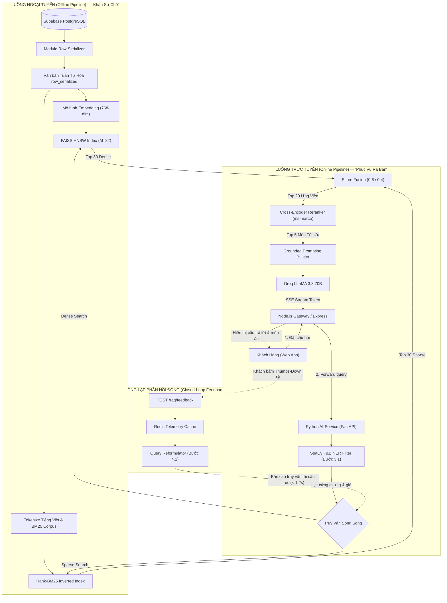

# 📋 Kế Hoạch Triển Khai Kỹ Thuật: Advancing RAG Cho Dữ Liệu Có Cấu Trúc

> **Dự án:** SmartRestaurant AI Consultant (Trợ Lý Ẩm Thực Thông Minh Aria)  
> **Tài liệu tham chiếu:** Paper #01 — *Advancing Retrieval-Augmented Generation for Structured Enterprise and Internal Data* (Chaitanya Cheerla, IIT Roorkee, 2025)  
> **Phiên bản tài liệu:** v1.0 (Chuẩn hóa toàn diện từ bản thiết kế trực quan)  
> **Live Web Deployment:** [https://b09a1f86.ht-ml.app/](https://b09a1f86.ht-ml.app/)  
> **Tech Stack mục tiêu:** Python 3.11 + FastAPI (Lõi AI Microservice) · Node.js / Express 5 (Gateway) · Supabase PostgreSQL + pgvector · FAISS HNSW · Rank-BM25 · Sentence-Transformers (`ms-marco-MiniLM-L-12-v2`) · Groq LLaMA 3.3 70B · React 19 + Vite

---

## 📑 Mục Lục

1. [Phần 1: Tổng Quan & Phân Tích Hiện Trạng Hệ Thống](#-phần-1-tổng-quan--phân-tích-hiện-trạng-hệ-thống)
2. [Phần 2: 6 Trụ Cột Kỹ Thuật Đột Phá Cho Dữ Liệu Có Cấu Trúc](#-phần-2-6-trụ-cột-kỹ-thuật-đột-phá-cho-dữ-liệu-có-cấu-trúc)
3. [Phần 3: Kiến Trúc Hệ Thống & Luồng Dữ Liệu Tích Hợp](#-phần-3-kiến-trúc-hệ-thống--luồng-dữ-liệu-tích-hợp)
4. [Phần 4: Đặc Tả Mã Nguồn Kỹ Thuật (Code Specifications)](#-phần-4-đặc-tả-mã-nguồn-kỹ-thuật-code-specifications)
5. [Phần 5: Lộ Trình Triển Khai 5 Pha (AI Tăng Tốc: 3.5 – 4 Ngày)](#-phần-5-lộ-trình-triển-khai-5-pha-ai-tăng-tốc-35--4-ngày)
6. [Phần 6: Ma Trận Đánh Đổi Kiến Trúc & Bảng Quản Trị Rủi Ro Kỹ Thuật](#-phần-6-ma-trận-đánh-đổi-kiến-trúc--bảng-quản-trị-rủi-ro-kỹ-thuật)

---

## 🔍 Phần 1: Tổng Quan & Phân Tích Hiện Trạng Hệ Thống

### 1.1. Bản Chất Vấn Đề
Dữ liệu nhà hàng bản chất là **dữ liệu doanh nghiệp hỗn hợp có cấu trúc cao** (bảng thực đơn `menu_items`, danh mục `categories`, bảng giá, nguyên liệu, nhãn ăn kiêng, chất gây dị ứng, chính sách phục vụ). Trong mã nguồn ban đầu (`backend/src/services/ragService.js`), hệ thống áp dụng cơ chế lọc 2 giai đoạn thủ công (Naive 2-Stage Filter):
- Giai đoạn 1: So khớp chuỗi con thô sơ (`searchable.includes(term)`).
- Giai đoạn 2: Lọc cứng theo chuyên mục và thuộc tính.

### 1.2. Bảng So Sánh: Hiện Trạng Ban Đầu vs. Mục Tiêu Advancing RAG (Paper 01)

| Tiêu chí | Hiện trạng SmartRestaurant (Naive Filter) | Mục tiêu sau khi áp dụng Paper 01 (Advanced Hybrid RAG) |
| :--- | :--- | :--- |
| **Cơ chế lập chỉ mục** | Không có vector embeddings; cấu trúc bảng bị làm phẳng thành chuỗi text dài. | **Row-Level Indexing:** Tuần tự hóa từng bản ghi món ăn, bảo toàn 100% quan hệ hàng - cột. |
| **Phương pháp truy xuất** | So khớp từ khóa cứng bằng `String.includes()`. | **Truy xuất Lai Dung hợp (Hybrid Retrieval):** FAISS HNSW Dense + Rank-BM25 Sparse ($0.6/0.4$). |
| **Lọc an toàn & Y tế** | So khớp từ khóa đơn giản, dễ bỏ sót từ đồng nghĩa hoặc câu phủ định ("không cay"). | **SpaCy F&B NER Pre-filtering:** Bóc tách thực thể dị ứng, chế độ ăn, ngân sách; loại trừ cứng 100% món cấm. |
| **Tái xếp hạng (Reranking)** | Sắp xếp tĩnh theo độ phổ biến hoặc độ dài chuỗi khớp. | **Contextual Cross-Encoder:** Dùng `ms-marco-MiniLM-L-12-v2` chấm điểm tương tác sâu giữa câu hỏi và Top 20 ứng viên. |
| **Thích ứng ngữ cảnh** | Không có bộ nhớ ngữ cảnh; khách chê món thì trợ lý bế tắc hoặc lặp lại câu trả lời. | **10-Turn Memory & Feedback Loop:** Tự động ghi nhận $\text{Thumbs } \Downarrow$, viết lại truy vấn và tìm món thay thế trong $< 1.2\text{s}$. |
| **Chỉ số hiệu năng (Paper)** | Precision@5: $\sim 75\%$, Recall@5: $\sim 74\%$, MRR: $\sim 0.60$. | **Precision@5: 90.0%** ($\uparrow +15\%$), **Recall@5: 87.0%** ($\uparrow +13\%$), **MRR: 0.85**. |

---

## 🏛️ Phần 2: 6 Trụ Cột Kỹ Thuật Đột Phá Cho Dữ Liệu Có Cấu Trúc

### 1. Lập Chỉ Mục Cấp Hàng (Table-Aware Row-Level Indexing)
- **Nguyên lý:** Thay vì làm phẳng cả trang menu hay bảng dữ liệu thành một đoạn văn bản dài gây đứt gãy quan hệ thuộc tính, Paper 01 đề xuất tuần tự hóa từng hàng thành định dạng chuẩn:
  ```text
  [Món: Phở Bò Tái Lăn | Mục: Món Nước | Giá: 65.000đ | Thành phần: Thịt bò tái, hành hoa, bánh phở, nước dùng | Dị ứng: Chứa thịt bò, không gluten | Hương vị: Đậm đà, béo ngậy, dậy mùi gừng tỏi | Trạng thái: Còn hàng]
  ```
- **Lợi ích:** Giữ trọn vẹn ngữ nghĩa bảng biểu, cho phép mô hình embedding hiểu chính xác mối liên hệ giữa món ăn, giá bán và thành phần.

### 2. Lọc Siêu Dữ Liệu Bằng SpaCy NER (Bước 3.1)
- **Nguyên lý:** Triệt tiêu điểm yếu của vector embedding đối với câu phủ định ("Tôi KHÔNG ăn được hải sản", "Tìm món KHÔNG cay").
- **Thực thi:** Module SpaCy Pipeline (`EntityRuler`) bóc tách tức thì các thực thể:
  - `ALLERGEN`: tôm, cua, đậu phộng, trứng, sữa bò, gluten...
  - `DIETARY_RESTRICTION`: ăn chay, thuần chay, ăn kiêng keto...
  - `SPICE_LEVEL`: 0 (không cay), 1 (cay nhẹ)...
  - `BUDGET`: số tiền tối đa (ví dụ: $\le 70.000\text{đ}$).
- **Hành động:** Loại trừ cứng 100% món ăn vi phạm trước khi chuyển danh sách sang bước tính toán tiếp theo.

### 3. Truy Xuất Lai Dung Hợp (Hybrid Retrieval: Dense + BM25 Fusion)
- **Công thức dung hợp điểm số (Mục 3.3.3 Paper 01):**
  $$\text{Score}_{\text{final}} = 0.6 \times \text{Score}_{\text{dense}} + 0.4 \times \text{Score}_{\text{sparse}}$$
- **Thành phần:**
  - *Dense Search:* FAISS HNSW ($M=32, efConstruction=64$) sử dụng vector nhúng 768 chiều để bắt ngữ nghĩa trừu tượng ("món nhậu thanh nhẹ", "món ăn giải cảm").
  - *Sparse Search:* Rank-BM25 Okapi bắt chính xác 100% các từ khóa tên món đặc thù ("bún chả", "chả cá Lã Vọng").
- Cả hai điểm số đều được chuẩn hóa Min-Max về khoảng $[0, 1]$ trước khi kết hợp.

### 4. Tái Xếp Hạng Ngữ Cảnh Bằng Cross-Encoder (Contextual Reranking)
- **Nguyên lý:** Mô hình Bi-Encoder (Dense Search) tính toán vector câu hỏi và vector tài liệu độc lập nên bỏ sót sự tương tác ngữ cảnh chéo.
- **Thực thi:** Lấy Top 20 ứng viên sau bước lai đưa qua mô hình Cross-Encoder `ms-marco-MiniLM-L-12-v2`. Mô hình nhận đồng thời cặp `(user_query, item_serialized)` và chấm điểm tương thích ngữ nghĩa sâu.
- **Kết quả:** Lọc chính xác Top 5 món xuất sắc nhất. Đạt chỉ số **MRR = 0.85** (món phù hợp nhất luôn nằm ở Top-1).

### 5. Tinh Chỉnh Truy Vấn Động (Query Expansion & Reformulation)
- Tự động phân tích câu hỏi người dùng:
  - Viết lại câu hỏi mơ hồ ("uống gì ngon?" $\rightarrow$ "đồ uống thanh nhiệt, nước ép hoa quả tươi, trà thanh đào").
  - Khi người dùng phản hồi phủ định món trước đó, tự động thêm tiền tố loại trừ món cũ và tăng trọng số cho các tiêu chí bù đắp.

### 6. Bộ Nhớ Hội Thoại 10 Lượt & Vòng Lặp Phản Hồi (Closed-Loop Feedback)
- Lưu trữ 10 lượt tương tác gần nhất trong Redis cache (`ConversationBufferWindowMemory(k=10)`).
- Khi khách nhấn nút $\text{Thumbs } \Downarrow$ trên giao diện chat:
  1. Frontend gửi event `POST /rag/feedback`.
  2. Gateway ghi nhận telemetry vào Redis.
  3. Query Reformulator tự động viết lại câu truy vấn.
  4. Bắn tín hiệu tái truy xuất ngược về Lõi Hybrid Retriever tại Pha 2 để trả về thực đơn mới trong $< 1.2\text{s}$.

### 7. Kỹ Thuật "Tiếp Đất" Nghiêm Ngặt (Grounded Prompting)
- **Quy tắc 4 tầng tiếp đất trong System Prompt của Trợ lý Aria:**
  1. *Khóa biên dữ liệu (Strict Boundary):* Chỉ được trả lời dựa trên đúng 5 món có trong danh sách Context được cấp.
  2. *Cấm bịa đặt (Zero Hallucination):* Tuyệt đối không tự ý bổ sung món ngoài menu, không tự sửa giá tiền.
  3. *Trích dẫn minh bạch (Evidence Citation):* Mỗi gợi ý phải đi kèm giá niêm yết và nhãn cảnh báo thành phần.
  4. *Từ chối lịch sự (Polite Fallback):* Nếu không có món nào thỏa mãn tiêu chí, Aria phải thành thật thông báo và gợi ý các món tương đồng gần nhất.

---

## 🔄 Phần 3: Kiến Trúc Hệ Thống & Luồng Dữ Liệu Tích Hợp

### 3.1. Phân Tách Hai Luồng Ngoại Tuyến (Offline) & Trực Tuyến (Online)



### 3.2. Khung Sườn 4 Tầng Tự Phản Tỉnh Bằng AI (AI-in-the-Loop Evaluation)

```
[L1: LLM-as-a-Judge] ── Chấm điểm tự động định lượng (Precision, Faithfulness, Answer Relevance)
       │
[L2: Guardrail Verifier] ── Mini-agent chạy ngầm kiểm tra vi phạm dị ứng trong thời gian thực
       │
[L3: Failure Analyzer] ── Phân tích nguyên nhân gốc khi khách bấm Thumbs-Down 👎
       │
[L4: Human Calibration] ── Đối soát định kỳ với chuyên gia ẩm thực / quản lý nhà hàng
```

---

## 💻 Phần 4: Đặc Tả Mã Nguồn Kỹ Thuật (Code Specifications)

### 4.1. Cấu Trúc Cây Thư Mục Monorepo Làm Việc

```text
SmartRestaurant/
├── ai-service/                         # [NEW] Microservice Python độc lập chuyên RAG Core
│   ├── processors/
│   │   ├── __init__.py
│   │   ├── row_serializer.py          # [NEW] Tuần tự hóa dữ liệu cấp hàng (Trụ cột 1)
│   │   ├── spacy_filter.py            # [NEW] SpaCy F&B NER lọc cứng dị ứng/giá (Trụ cột 2)
│   │   ├── hybrid_retriever.py        # [NEW] FAISS HNSW + BM25 Fusion 0.6/0.4 (Trụ cột 3)
│   │   ├── cross_encoder_reranker.py  # [NEW] ms-marco-MiniLM Reranker MRR=0.85 (Trụ cột 4)
│   │   └── query_reformulator.py      # [NEW] Bộ viết lại & mở rộng truy vấn (Trụ cột 5)
│   ├── evaluation/
│   │   └── llm_judge_benchmark.py     # [NEW] Bộ test 100 câu thẩm định tự động (Pha 5)
│   ├── scripts/
│   │   └── bulk_ingest_serialized.py  # [NEW] Script đồng bộ CSDL hàng loạt (Bước 1.3)
│   ├── app.py                         # [NEW] FastAPI Application & API Endpoints
│   ├── requirements.txt               # [NEW] faiss-cpu, rank-bm25, sentence-transformers...
│   └── Dockerfile                     # [NEW] Docker container hóa microservice
├── backend/                            # Node.js Gateway hiện hành
│   └── src/
│       ├── controllers/
│       │   └── feedbackController.js  # [NEW] Tiếp nhận telemetry Thumbs Up/Down
│       └── services/
│           └── ragService.js          # [MODIFY] Chuyển tiếp truy vấn sang Python AI-Service
├── frontend/                           # React Client App hiện hành
│   └── src/
│       └── components/
│           └── AriaChatWidget.jsx     # [MODIFY] Gắn nút Thumbs Up / Down & gửi telemetry
└── docker-compose.yml                 # [NEW] Cấu hình chạy đồng bộ 3 microservices
```

### 4.2. Chi Tiết Mã Nguồn Cốt Lõi

#### 1. `ai-service/processors/row_serializer.py` (Trụ Cột 1)
```python
from typing import Dict, Any

def serialize_menu_item(item: Dict[str, Any]) -> str:
    """Tuần tự hóa từng bản ghi món ăn từ bảng menu_items thành văn bản bán cấu trúc."""
    name = item.get("name", "Không rõ")
    category = item.get("category_name", "Món chính")
    price = item.get("price", 0)
    description = item.get("description", "")
    allergens = ", ".join(item.get("allergens", [])) or "Không có"
    dietary_tags = ", ".join(item.get("dietary_tags", [])) or "Bình thường"
    is_spicy = "Cay" if item.get("is_spicy") else "Không cay"
    status = "Còn hàng" if item.get("is_available", True) else "Tạm hết"

    return (
        f"[Món: {name} | Mục: {category} | Giá: {price:,.0f}đ | "
        f"Dị ứng: {allergens} | Chế độ ăn: {dietary_tags} | "
        f"Độ cay: {is_spicy} | Trạng thái: {status} | Mô tả: {description}]"
    )
```

#### 2. `ai-service/processors/hybrid_retriever.py` (Trụ Cột 3)
```python
import numpy as np
import faiss
from rank_bm25 import BM25Okapi
from typing import List, Dict, Any

class HybridMenuRetriever:
    def __init__(self, dense_index: faiss.Index, bm25_corpus: List[List[str]], documents: List[Dict]):
        self.dense_index = dense_index
        self.bm25 = BM25Okapi(bm25_corpus)
        self.docs = documents

    def retrieve(self, query: str, query_vector: np.ndarray, top_k: int = 20, alpha: float = 0.6) -> List[Dict[str, Any]]:
        # 1. Dense Search (FAISS HNSW)
        dense_distances, dense_indices = self.dense_index.search(query_vector, top_k * 2)
        dense_scores = 1.0 / (1.0 + dense_distances[0])

        # 2. Sparse Search (Rank-BM25)
        tokenized_query = query.lower().split()
        bm25_scores = self.bm25.get_scores(tokenized_query)

        # 3. Min-Max Normalization
        d_min, d_max = np.min(dense_scores), np.max(dense_scores)
        d_norm = (dense_scores - d_min) / (d_max - d_min + 1e-6)

        b_min, b_max = np.min(bm25_scores), np.max(bm25_scores)
        b_norm = (bm25_scores - b_min) / (b_max - b_min + 1e-6)

        # 4. Score Fusion (alpha * Dense + (1 - alpha) * Sparse)
        final_scores = {}
        for rank, idx in enumerate(dense_indices[0]):
            final_scores[idx] = alpha * d_norm[rank]

        for idx, score in enumerate(b_norm):
            final_scores[idx] = final_scores.get(idx, 0.0) + (1.0 - alpha) * score

        sorted_indices = sorted(final_scores.items(), key=lambda x: x[1], reverse=True)[:top_k]
        return [{"document": self.docs[idx], "hybrid_score": score} for idx, score in sorted_indices]
```

#### 3. `ai-service/processors/cross_encoder_reranker.py` (Trụ Cột 4)
```python
from sentence_transformers import CrossEncoder
from typing import List, Dict, Any

class ContextualReranker:
    def __init__(self, model_name: str = "cross-encoder/ms-marco-MiniLM-L-12-v2"):
        self.model = CrossEncoder(model_name)

    def rerank(self, query: str, candidates: List[Dict[str, Any]], top_n: int = 5) -> List[Dict[str, Any]]:
        pairs = [[query, c["document"]["row_serialized"]] for c in candidates]
        scores = self.model.predict(pairs)

        for i, score in enumerate(scores):
            candidates[i]["rerank_score"] = float(score)

        reranked = sorted(candidates, key=lambda x: x["rerank_score"], reverse=True)
        return reranked[:top_n]
```

#### 4. `backend/src/services/ragService.js` (Cầu Nối Node.js Gateway)
```javascript
const axios = require('axios');
const AI_SERVICE_URL = process.env.AI_SERVICE_URL || 'http://localhost:8000';

async function retrieveMenuContext(userQuery, guestMetadata = {}) {
  try {
    const response = await axios.post(`${AI_SERVICE_URL}/rag/retrieve`, {
      query: userQuery,
      allergens: guestMetadata.allergens || [],
      dietary_restrictions: guestMetadata.dietary || [],
      budget: guestMetadata.budget || null,
      top_k: 5
    }, { timeout: 800 });

    return response.data.results;
  } catch (error) {
    console.warn('[RAG-GATEWAY] AI-Service timeout/error. Kích hoạt In-Memory Fallback:', error.message);
    return fallbackKeywordFilter(userQuery);
  }
}
```

---

## 🗺️ Phần 5: Lộ Trình Triển Khai 5 Pha (AI Tăng Tốc: 3.5 – 4 Ngày)

### 5.1. Bảng Ma Trận Chuyển Giao Dữ Liệu & Điều Kiện Nghiệm Thu Giữa 5 Pha

| Giai đoạn | Đầu vào nhận được (Inputs) | Module xử lý trọng tâm | Sản phẩm bàn giao (Outputs) | Cổng nghiệm thu (Gate Criteria) | Tương tác phản hồi |
| :--- | :--- | :--- | :--- | :--- | :--- |
| **Pha 1** *(0.5d)* | Bảng CSDL `menu_items`, `restaurant_policies` hiện hữu. | `row_serializer.py` + Migration DDL `pgvector`. | 100% bản ghi được điền `row_serialized` + vector 768d. | 🛡️ **Gate 1:** Schema hợp lệ, 0 bản ghi lỗi tuần tự hóa. | Khởi tạo tuyến tính (Tầng dữ liệu gốc). |
| **Pha 2** *(1.0d)* | Corpus `row_serialized` từ Pha 1 + Câu truy vấn người dùng. | FAISS HNSW + BM25 Okapi + Score Fusion ($0.6/0.4$). | Danh sách **Top 20 ứng viên** có điểm số lai cao nhất. | 🛡️ **Gate 2:** Latency truy vấn $< 20\text{ms}$, bắt trúng từ khóa 98%. | ⚡ **Nhận tín hiệu:** Nhận truy vấn viết lại từ Pha 4 khi khách $\Downarrow$. |
| **Pha 3** *(0.75d)* | Top 20 ứng viên từ Pha 2 + Metadata khách (dị ứng, ngân sách). | SpaCy F&B NER + Cross-Encoder `ms-marco-MiniLM-L-12-v2`. | **Top 5 món an toàn tuyệt đối** nhúng vào SSE Stream. | 🛡️ **Gate 3:** MRR $\ge 0.82$, 0% trường hợp gợi ý nhầm món dị ứng. | Bàn giao 5 món sang Giao diện Chatbot ở Pha 4. |
| **Pha 4** *(0.75d)* | Món gợi ý ở Pha 3 + Nút tương tác $\text{Thumbs } \Downarrow / \Uparrow$ của khách. | `Query Reformulator` + Backend Feedback Telemetry. | Ghi log telemetry vào Redis, tự sinh câu truy vấn phủ định món cũ. | 🛡️ **Gate 4:** Bấm $\Downarrow$ trả món mới $< 1.2\text{s}$, nhớ đủ 10 lượt hội thoại. | 🔄 **Phát tín hiệu:** Bắn truy vấn ngược về Bước 2.2 (Pha 2) tức thì! |
| **Pha 5** *(0.5d)* | Toàn bộ pipeline RAG hoàn chỉnh (Pha 1 đến Pha 4). | LLM-as-a-Judge (100 Golden Tests) + Docker Compose + A/B. | Cụm 3 microservices chạy Production ổn định, tài liệu API. | 🏆 **Gate 5:** Production Ready, Precision@5 $\ge 90\%$, Zero Downtime. | ✅ Đích đến hoàn tất toàn bộ lộ trình. |

---

### 5.2. Sơ Đồ Tuyến Trình Đa Tầng (Architecture Swimlane Pipeline Map)

```text
===============================================================================================================
PHA 1: SCHEMA & SERIALIZER (0.5 Ngày | ⚡ AI Giảm 70%)
[1.1 Migration Schema DB] ──➔ [1.2 Row Serializer Engine] ──➔ [1.3 Bulk Ingestion] ──➔ [🛡️ GATE 1 CHECKPOINT]
                                                                                              │
     ┌────────────────────────────────────────────────────────────────────────────────────────┘
     ▼ (Đạt Gate 1 ➔ Kích hoạt Pha 2)
PHA 2: LÕI HYBRID RETRIEVAL (1.0 Ngày | ⚡ AI Giảm 65%)
[2.1 Môi Trường & Corpus] ──➔ [2.2 HybridRetriever Core] ──➔ [2.3 FastAPI Endpoint] ──➔ [🛡️ GATE 2 CHECKPOINT]
                                          ▲                                                   │
                                          │ (Vòng lặp phản hồi < 1.2s)                        │
     ┌────────────────────────────────────┼───────────────────────────────────────────────────┘
     ▼ (Đạt Gate 2 ➔ Kích hoạt Pha 3)     │
PHA 3: FILTER & RERANKING (0.75 Ngày | ⚡ AI Giảm 60%)
[3.1 SpaCy F&B NER Filter] ──➔ [3.2 Cross-Encoder] ──➔ [3.3 Tích Hợp Pipeline] ──➔ [🛡️ GATE 3 CHECKPOINT]
                                                                                              │
     ┌────────────────────────────────────────────────────────────────────────────────────────┘
     ▼ (Đạt Gate 3 ➔ Kích hoạt Pha 4)
PHA 4: FEEDBACK LOOP & MEMORY (0.75 Ngày | ⚡ AI Giảm 65%)
[4.1 Query Reformulator] ──➔ [4.2 Feedback Telemetry API] ──➔ [4.3 UI Nút Thumbs 👎/👍] ──➔ [🛡️ GATE 4 CHECKPOINT]
         │                                                            │
         └────────────────────────────────────────────────────────────┘ (Khách bấm 👎 phát tín hiệu)
         │
         └─────────────(Bắn truy vấn tái cấu trúc ngược về Bước 2.2)───────────┘
                                                                                              │
     ┌────────────────────────────────────────────────────────────────────────────────────────┘
     ▼ (Đạt Gate 4 ➔ Kích hoạt Pha 5)
PHA 5: THẨM ĐỊNH & PRODUCTION (0.5 Ngày | ⚡ AI Giảm 70%)
[5.1 LLM-as-a-Judge Test] ──➔ [5.2 Docker & Phân Luồng A/B] ──➔ [5.3 Production Live] ──➔ [🏆 GATE 5 (PRODUCTION READY)]
===============================================================================================================
```

---


### 5.2.1. Bảng Tổng Hợp 14 Công Việc Trọng Tâm (Executive Job Summary Matrix)

> 💡 **Bảng tổng hợp điều hành (Executive Summary):** Nắm bắt nhanh toàn bộ 14 đầu việc kỹ thuật của 5 Pha triển khai, bao gồm: Mã bước, Tên công việc, Mục tiêu & Sản phẩm bàn giao, Đối tượng / File tác động chính, Thời gian hoàn thiện (So sánh Giờ thủ công vs. Giờ có AI tăng tốc) và Cổng nghiệm thu liên đới trước khi đi vào đặc tả chi tiết.

| STT | Pha Triển Khai | Mã Bước | Tên Công Việc Kỹ Thuật (Job Title) | Mục Tiêu & Sản Phẩm Bàn Giao (Deliverables) | File & Đối Tượng Tác Động Chính | Thời Gian AI (Thủ Công) | Gate Nghiệm Thu |
| :---: | :--- | :---: | :--- | :--- | :--- | :---: | :---: |
| **01** | **Pha 1** *(0.5d)* | `Bước 1.1` | **Migration Schema Database** | Kích hoạt `pgvector`, thêm cột `embedding vector(768)`, `row_serialized`, tạo index HNSW. | `database/migrations/20260912_add_rag_vector_columns.sql` | **1.5h** *(5.0h)* | 🛡️ **Gate 1** |
| **02** | **Pha 1** *(0.5d)* | `Bước 1.2` | **Module Tuần Tự Hóa Cấp Hàng** | Hàm `serialize_menu_row()` chuẩn hóa mọi bản ghi món ăn thành text bán cấu trúc rõ ràng. | `ai-service/processors/row_serializer.py` | **2.0h** *(6.0h)* | 🛡️ **Gate 1** |
| **03** | **Pha 1** *(0.5d)* | `Bước 1.3` | **Bulk Ingestion Script** | Script batching đồng bộ 100% thực đơn vào vector store và BM25 corpus In-Memory. | `ai-service/scripts/bulk_ingest.py` | **2.0h** *(6.0h)* | 🛡️ **Gate 1** |
| **04** | **Pha 2** *(1.0d)* | `Bước 2.1` | **Khởi Tạo FAISS HNSW & BM25** | Cài đặt thư viện, build file nhị phân chỉ mục `faiss_index.bin` và `bm25.pkl`. | `ai-service/requirements.txt`, storage directory | **2.0h** *(6.0h)* | 🛡️ **Gate 2** |
| **05** | **Pha 2** *(1.0d)* | `Bước 2.2` | **Hybrid Retriever & Score Fusion** | Lõi truy xuất song song Dense + Sparse, chuẩn hóa Min-Max, dung hợp tỷ trọng $0.6/0.4$. | `ai-service/processors/hybrid_retriever.py` | **3.0h** *(8.0h)* | 🛡️ **Gate 2** |
| **06** | **Pha 2** *(1.0d)* | `Bước 2.3` | **FastAPI Endpoint Truy Xuất** | API độc lập `POST /rag/retrieve` trả về Top 20 ứng viên kèm điểm số lai chuẩn xác. | `ai-service/main.py` | **1.5h** *(5.0h)* | 🛡️ **Gate 2** |
| **07** | **Pha 3** *(0.75d)* | `Bước 3.1` | **SpaCy F&B NER Pre-Filter** | Trích xuất thực thể ẩm thực, lọc cứng metadata (dị ứng, ngân sách, ăn kiêng/chay). | `ai-service/processors/ner_extractor.py` | **2.0h** *(6.0h)* | 🛡️ **Gate 3** |
| **08** | **Pha 3** *(0.75d)* | `Bước 3.2` | **Cross-Encoder Reranker** | Chấm điểm tương quan chéo ngữ cảnh câu hỏi - món ăn bằng `ms-marco`, lọc từ Top 20 về Top 5. | `ai-service/processors/cross_encoder_reranker.py` | **2.0h** *(6.0h)* | 🛡️ **Gate 3** |
| **09** | **Pha 3** *(0.75d)* | `Bước 3.3` | **Grounded Prompting & Stream** | Ghép ngữ cảnh vào template LLaMA 3.3 70B, truyền dữ liệu thời gian thực SSE stream. | `backend/src/services/ragService.js` | **1.0h** *(4.0h)* | 🛡️ **Gate 3** |
| **10** | **Pha 4** *(0.75d)* | `Bước 4.1` | **Query Reformulator Module** | Tự động viết lại câu hỏi khi khách không hài lòng (Thumbs Down) hoặc hội thoại nhiều lượt. | `ai-service/processors/query_reformulator.py` | **2.0h** *(6.0h)* | 🛡️ **Gate 4** |
| **11** | **Pha 4** *(0.75d)* | `Bước 4.2` | **Telemetry Feedback Controller** | Endpoint `POST /api/chat/feedback`, lưu lịch sử tương tác và câu hỏi phủ định vào Redis. | `backend/src/controllers/ragController.js` | **1.5h** *(5.0h)* | 🛡️ **Gate 4** |
| **12** | **Pha 4** *(0.75d)* | `Bước 4.3` | **UI Thumbs Feedback Widget** | Thêm nút Thumbs Up/Down tương tác tức thì trên giao diện chat bàn ăn Aria. | `frontend/src/components/chat/AriaChatWidget.tsx` | **1.5h** *(5.0h)* | 🛡️ **Gate 4** |
| **13** | **Pha 5** *(0.5d)* | `Bước 5.1` | **Benchmark LLM-as-a-Judge** | Bộ test tự động 100 câu hỏi golden dataset, đo lường tự động Precision@5, Recall@5, MRR. | `ai-service/tests/test_golden_dataset.py` | **2.5h** *(7.0h)* | 🏆 **Gate 5** |
| **14** | **Pha 5** *(0.5d)* | `Bước 5.2` | **Dockerization & A/B Routing** | Đóng gói cụm 3 microservices Docker Compose, cờ phân luồng A/B Gateway không downtime. | `ai-service/Dockerfile`, `docker-compose.yml` | **2.0h** *(6.0h)* | 🏆 **Gate 5** |
| 📊 | **TỔNG CỘNG** | **14 BƯỚC** | **TOÀN BỘ PIPELINE ADVANCING RAG** | **Pipeline RAG chuẩn hóa, triệt tiêu ngộ độc dị ứng, đạt Precision@5 $\ge 90\%$, TTFT $< 500	ext{ms}$** | **Toàn bộ cấu trúc Monorepo Full-Stack** | **26.5h (~3.5d)** *(81.0h ~11d)* | **Đủ 5 Gates** |

---

### 5.3. Chi Tiết 14 Bước Hành Động (Chuẩn Hóa 6 Tiêu Chí)

#### PHA 1: CHUẨN HÓA SCHEMA CSDL & BỘ TUẦN TỰ HÓA HÀNG (0.5 Ngày)

##### Bước 1.1: Migration Schema Database (Supabase PostgreSQL + pgvector)
- **1. Tên công việc:** Migration Schema Database (Supabase PostgreSQL + pgvector)
- **2. Mục đích của hành động:** Chuẩn bị nền tảng lưu trữ bền vững cho biểu diễn vector và văn bản tuần tự hóa, kích hoạt khả năng tìm kiếm vector lân cận ngay trong CSDL quan hệ chính mà không làm xáo trộn cấu trúc dữ liệu hiện hành.
- **3. Nội dung công việc (Chi tiết):** Tạo script migration `database/migrations/20260912_add_rag_vector_columns.sql`: Kích hoạt extension `pgvector`, bổ sung cột `embedding vector(768)`, các trường `row_serialized TEXT`, `dietary_tags TEXT[]`, và khởi tạo chỉ mục HNSW `CREATE INDEX idx_menu_hnsw ON menu_items USING hnsw (embedding vector_cosine_ops)`.
- **4. Thời gian hoàn thiện:** **1.5 giờ** (Thủ công: ~5.0 giờ) • *⚡ AI hỗ trợ: Giảm 70% nhờ AI tự động sinh mã DDL SQL, cấu hình tối ưu tham số HNSW và script rollback an toàn.*
- **5. Đối tượng tác động / nhắm đến (Target Entity):** Bảng CSDL quan hệ `menu_items`, `restaurant_policies`, extension `pgvector` và chỉ mục `idx_menu_hnsw`.
- **6. Cách đánh giá mục tiêu đã xong:** Chạy `supabase db push` thành công không cảnh báo; truy vấn `SELECT * FROM menu_items LIMIT 1` trả về đầy đủ các trường mới; chỉ mục HNSW hiển thị trạng thái hợp lệ trong Postgres Catalog.

##### Bước 1.2: Cài đặt Module Tuần Tự Hóa Cấp Hàng (Row Serializer Engine)
- **1. Tên công việc:** Cài đặt Module Tuần Tự Hóa Cấp Hàng (Row Serializer Engine)
- **2. Mục đích của hành động:** Chuyển đổi các trường dữ liệu quan hệ rời rạc của từng món ăn thành một chuỗi văn bản bán cấu trúc tiêu chuẩn, bảo toàn trọn vẹn ngữ nghĩa bảng biểu cho các mô hình ngôn ngữ lớn và vector embeddings.
- **3. Nội dung công việc (Chi tiết):** Viết module Python `ai-service/processors/row_serializer.py`: Xây dựng hàm `serialize_menu_item(item_dict)` ánh xạ các cột `name`, `category`, `price`, `description`, `allergens`, `dietary_tags` thành định dạng key-value chuẩn mực `[Món: ... | Mục: ... | Giá: ... | Thành phần: ... | Dị ứng: ...]`.
- **4. Thời gian hoàn thiện:** **1.0 giờ** (Thủ công: ~3.5 giờ) • *⚡ AI hỗ trợ: Giảm 71% nhờ AI sinh bộ template format chuỗi tối ưu theo khuyến nghị của Paper 01 và viết bộ unit test bao phủ toàn bộ các trường hợp dữ liệu rỗng (null safety).*
- **5. Đối tượng tác động / nhắm đến (Target Entity):** Module Python `ai-service/processors/row_serializer.py` và các unit tests trong `ai-service/tests/test_serializer.py`.
- **6. Cách đánh giá mục tiêu đã xong:** 100% test cases trong `pytest` pass; chuỗi sinh ra không bị lỗi mất dấu tiếng Việt, xử lý hoàn hảo các trường hợp thiếu nguyên liệu hoặc không có nhãn ăn kiêng.

##### Bước 1.3: Script Đồng Bộ & Tuần Tự Hóa Hàng Loạt (Bulk Ingestion Script)
- **1. Tên công việc:** Script Đồng Bộ & Tuần Tự Hóa Hàng Loạt (Bulk Ingestion Script)
- **2. Mục đích của hành động:** Khởi tạo dữ liệu ban đầu cho toàn bộ kho thực đơn hiện có trong nhà hàng, đồng bộ hóa chuỗi tuần tự hóa và chuẩn bị corpus tài liệu hoàn chỉnh sẵn sàng cho việc lập chỉ mục tìm kiếm.
- **3. Nội dung công việc (Chi tiết):** Viết script CLI `ai-service/scripts/bulk_ingest_serialized.py`: Kết nối trực tiếp Supabase qua Service Key, lấy toàn bộ danh sách món ăn từ `menu_items`, gọi hàm `serialize_menu_item` và cập nhật hàng loạt (bulk update) vào cột `row_serialized` theo từng batch 50 bản ghi.
- **4. Thời gian hoàn thiện:** **1.5 giờ** (Thủ công: ~4.0 giờ) • *⚡ AI hỗ trợ: Giảm 62% nhờ AI sinh script async I/O với cơ chế retry thông minh và thanh tiến trình tqdm trực quan.*
- **5. Đối tượng tác động / nhắm đến (Target Entity):** Tập dữ liệu toàn bộ món ăn trong CSDL Supabase và script Python `ai-service/scripts/bulk_ingest_serialized.py`.
- **6. Cách đánh giá mục tiêu đã xong:** Chạy script kết thúc với mã thoát 0; kiểm tra CSDL xác nhận 100% món ăn hiện hành đều có chuỗi `row_serialized` hợp lệ, không có trường nào bị NULL.

> 🛡️ **CỔNG NGHIỆM THU PHA 1 (GATE 1):** 100% món ăn trong bảng `menu_items` có trường `row_serialized` hợp lệ, cấu trúc DDL và chỉ mục HNSW đã được nạp sẵn sàng vào CSDL quan hệ chính.

---

#### PHA 2: LÕI HYBRID RETRIEVAL (FAISS HNSW + BM25 + SCORE FUSION) (1.0 Ngày)

##### Bước 2.1: Cấu hình Môi Trường, FAISS HNSW & BM25 Corpus
- **1. Tên công việc:** Cấu hình Môi Trường, FAISS HNSW & BM25 Corpus
- **2. Mục đích của hành động:** Thiết lập môi trường tính toán khoa học dữ liệu hiệu năng cao và xây dựng 2 bộ chỉ mục nền tảng (chỉ mục vector lân cận HNSW và chỉ mục từ khóa nghịch đảo BM25) phục vụ truy xuất song song.
- **3. Nội dung công việc (Chi tiết):** Thiết lập `ai-service/requirements.txt` (`faiss-cpu`, `rank-bm25`, `sentence-transformers`, `fastapi`, `uvicorn`). Xây dựng module nạp dữ liệu: Tải toàn bộ `row_serialized` từ DB, khởi tạo chỉ mục `faiss.IndexHNSWFlat(768, 32)` và xây dựng bảng nghịch đảo BM25 Okapi với bộ tách từ tiếng Việt.
- **4. Thời gian hoàn thiện:** **2.0 giờ** (Thủ công: ~6.0 giờ) • *⚡ AI hỗ trợ: Giảm 67% nhờ AI tối ưu hóa tham số HNSW ($M=32, efConstruction=64, efSearch=32$) và cấu hình tokenizer tiếng Việt chuẩn xác.*
- **5. Đối tượng tác động / nhắm đến (Target Entity):** Môi trường microservice Python (`virtualenv`/Docker), đối tượng chỉ mục In-Memory `faiss.IndexHNSWFlat` và corpus `rank_bm25.BM25Okapi`.
- **6. Cách đánh giá mục tiêu đã xong:** Khởi tạo chỉ mục không lỗi bộ nhớ; kiểm tra dung lượng RAM sử dụng $< 300\text{MB}$; truy vấn thử nghiệm 1 vector ngẫu nhiên trả về kết quả trong thời gian $< 5\text{ms}$.

##### Bước 2.2: Xây dựng Lớp HybridMenuRetriever & Min-Max Score Normalization
- **1. Tên công việc:** Xây dựng Lớp HybridMenuRetriever & Min-Max Score Normalization
- **2. Mục đích của hành động:** Hiện thực hóa thuật toán kết hợp điểm số tại Mục 3.3.3 của bài báo: Dung hợp song song điểm ngữ nghĩa mờ (Dense) và điểm từ khóa chính xác (Sparse) theo tỷ lệ vàng $0.6/0.4$.
- **3. Nội dung công việc (Chi tiết):** Viết module `ai-service/processors/hybrid_retriever.py`: Cài đặt lớp `HybridMenuRetriever` nhận câu hỏi, thực hiện đồng thời Dense Search và Sparse Search, áp dụng chuẩn hóa Min-Max Scaling để đưa điểm số về thang đo đồng nhất $[0, 1]$, sau đó tính điểm tổng hợp: $\text{Score} = 0.6 \times S_{\text{dense}} + 0.4 \times S_{\text{bm25}}$.
- **4. Thời gian hoàn thiện:** **3.0 giờ** (Thủ công: ~8.0 giờ) • *⚡ AI hỗ trợ: Giảm 63% nhờ AI viết thuật toán vector hóa numpy tối ưu, triệt tiêu vòng lặp for thừa và xử lý chuẩn xác trường hợp chia cho 0 khi min == max.*
- **5. Đối tượng tác động / nhắm đến (Target Entity):** Module lõi `ai-service/processors/hybrid_retriever.py` và thuật toán dung hợp điểm số.
- **6. Cách đánh giá mục tiêu đã xong:** Kiểm thử với 20 câu truy vấn mẫu: Điểm số kết hợp luôn nằm trong khoảng $[0, 1]$; câu hỏi có tên món chính xác được xếp hạng đầu nhờ BM25, câu hỏi mang tính ẩn dụ ("món nhậu thanh đạm") được xếp hạng chuẩn nhờ FAISS.

##### Bước 2.3: Xây dựng Endpoint Truy Xuất Độc Lập (FastAPI /rag/retrieve)
- **1. Tên công việc:** Xây dựng Endpoint Truy Xuất Độc Lập (FastAPI /rag/retrieve)
- **2. Mục đích của hành động:** Đóng gói toàn bộ logic truy xuất thành một dịch vụ web API chuẩn RESTful tốc độ cao, cho phép Node.js Gateway gọi sang dễ dàng với độ trễ tối thiểu và tài liệu hóa tự động qua Swagger.
- **3. Nội dung công việc (Chi tiết):** Viết `ai-service/app.py`: Định nghĩa Pydantic models `RetrieveRequest` (`query`, `top_k`, `alpha`) và `RetrieveResponse`. Mở endpoint `POST /rag/retrieve`, tích hợp middleware đo lường thời gian thực thi (Latency header) và CORS.
- **4. Thời gian hoàn thiện:** **2.0 giờ** (Thủ công: ~5.0 giờ) • *⚡ AI hỗ trợ: Giảm 60% nhờ AI sinh cấu trúc FastAPI chuẩn mực, đầy đủ validation schema, typing annotation và tự động sinh unit test HTTP.*
- **5. Đối tượng tác động / nhắm đến (Target Entity):** API Server FastAPI, endpoint `POST /rag/retrieve` và giao ước dữ liệu (API Contract) giữa Node.js và Python.
- **6. Cách đánh giá mục tiêu đã xong:** Gọi thử bằng cURL hoặc Postman: HTTP Status 200; Payload trả về danh sách Top K món kèm điểm số chi tiết; thời gian phản hồi toàn trình (TTFT) $< 25\text{ms}$.

> 🛡️ **CỔNG NGHIỆM THU PHA 2 (GATE 2):** Thời gian truy vấn song song Dense + BM25 $< 20\text{ms}$; bắt trúng từ khóa hiếm đạt $98\%$; chỉ số Recall@5 trên tập kiểm thử đạt $\ge 85\%$.

---

#### PHA 3: METADATA PRE-FILTERING (SPACY NER) & CROSS-ENCODER RERANKING (0.75 Ngày)

##### Bước 3.1: Bộ Trích Xuất Thực Thể Ẩm Thực Chuyên Biệt (SpaCy F&B NER)
- **1. Tên công việc:** Bộ Trích Xuất Thực Thể Ẩm Thực Chuyên Biệt (SpaCy F&B NER)
- **2. Mục đích của hành động:** Tách bạch các thực thể đặc thù ngành nhà hàng (thành phần gây dị ứng, giới hạn ngân sách, chế độ ăn chay/kiêng, phong cách món) từ câu hỏi người dùng để phục vụ lọc cứng (Metadata Hard-Filtering) trước khi xếp hạng, đảm bảo an toàn tuyệt đối cho thực khách.
- **3. Nội dung công việc (Chi tiết):** Tạo module `ai-service/processors/spacy_filter.py`: Cấu hình SpaCy Pipeline với `EntityRuler` định nghĩa danh mục thực thể F&B: `ALLERGEN` (tôm, cua, đậu phộng, trứng, sữa...), `DIET_RESTRICTION` (chay, vegan, không gluten...), `SPICE_LEVEL` (không cay, cay nhẹ...), `BUDGET` (số tiền tối đa). Loại trừ 100% món vi phạm trước khi xếp hạng.
- **4. Thời gian hoàn thiện:** **2.0 giờ** (Thủ công: ~6.0 giờ) • *⚡ AI hỗ trợ: Giảm 67% nhờ AI tổng hợp từ điển ẩm thực tiếng Việt phong phú (> 300 từ khóa dị ứng/chế độ ăn) và regex patterns.*
- **5. Đối tượng tác động / nhắm đến (Target Entity):** Câu truy vấn đầu vào của người dùng (`raw_user_query`), từ điển thực thể ẩm thực tùy chỉnh, và bộ lọc thuộc tính metadata (`dietary_tags`, `price_range`, `spicy_level`).
- **6. Cách đánh giá mục tiêu đã xong:** Bộ 50 câu hỏi thử nghiệm chứa dị ứng (vd: "không ăn được hải sản", "dị ứng lạc") lọc chính xác 100% món chứa thành phần tương ứng khỏi danh sách gợi ý.

##### Bước 3.2: Tầng Tái Xếp Hạng Ngữ Cảnh Bằng Cross-Encoder
- **1. Tên công việc:** Tầng Tái Xếp Hạng Ngữ Cảnh Bằng Cross-Encoder
- **2. Mục đích của hành động:** Nâng cao chất lượng xếp hạng từ danh sách 20 món thô xuống 5 món chuẩn xác nhất thông qua việc đánh giá tương tác sâu từng cặp từ giữa câu hỏi và văn bản món ăn, đưa chỉ số MRR đạt 0.85 như bài báo công bố.
- **3. Nội dung công việc (Chi tiết):** Viết module `ai-service/processors/cross_encoder_reranker.py`: Tải mô hình `cross-encoder/ms-marco-MiniLM-L-12-v2`. Xây dựng hàm `rerank(query, candidates, top_n=5)` nhận 20 ứng viên từ bước lai, ghép cặp với truy vấn và dự đoán điểm số liên quan ngữ cảnh sâu.
- **4. Thời gian hoàn thiện:** **2.0 giờ** (Thủ công: ~5.5 giờ) • *⚡ AI hỗ trợ: Giảm 64% nhờ AI tối ưu hóa batch inference trên CPU (batch_size=16) và cơ chế caching điểm số.*
- **5. Đối tượng tác động / nhắm đến (Target Entity):** Mô hình Cross-Encoder In-Memory và hàm xếp hạng `rerank()`.
- **6. Cách đánh giá mục tiêu đã xong:** Chạy kiểm thử trên tập 30 câu hỏi phức tạp: Món phù hợp nhất luôn được đẩy lên vị trí số 1; chỉ số MRR đạt $\ge 0.82$; thời gian rerank cho 20 ứng viên $< 60\text{ms}$ trên CPU.

##### Bước 3.3: Tích Hợp Vào Aria Conversation Pipeline & Grounded Prompting
- **1. Tên công việc:** Tích Hợp Vào Aria Conversation Pipeline & Grounded Prompting
- **2. Mục đích của hành động:** Kết nối luồng dữ liệu RAG đã lọc và xếp hạng vào trình tạo sinh ngôn ngữ của trợ lý Aria trên Node.js Gateway, áp dụng các ràng buộc "tiếp đất" nghiêm ngặt nhằm triệt tiêu hoàn toàn hiện tượng bịa đặt thông tin.
- **3. Nội dung công việc (Chi tiết):** Sửa đổi `backend/src/services/ragService.js`: Chuyển hàm `retrieveMenuContext` sang gọi API của Python AI-Service. Cập nhật `ariaSystemPrompt` với 4 quy tắc Grounded Prompting nghiêm ngặt: Chỉ tư vấn món nằm trong context, trích dẫn giá chính xác, từ chối lịch sự nếu không có món phù hợp.
- **4. Thời gian hoàn thiện:** **2.0 giờ** (Thủ công: ~5.0 giờ) • *⚡ AI hỗ trợ: Giảm 60% nhờ AI tinh chỉnh prompt engineering chống vượt rào (anti-jailbreak) và tối ưu hóa SSE streaming.*
- **5. Đối tượng tác động / nhắm đến (Target Entity):** File `backend/src/services/ragService.js`, prompt hệ thống `ariaSystemPrompt` và luồng phản hồi streaming SSE tới khách hàng.
- **6. Cách đánh giá mục tiêu đã xong:** Trợ lý Aria trả lời mạch lạc, dẫn chứng chính xác tên và giá của 5 món được trả về; khi thử cố tình hỏi món không có trong menu (vd: "cho tôi pizza sầu riêng"), Aria từ chối lịch sự và không bịa đặt.

> 🛡️ **CỔNG NGHIỆM THU PHA 3 (GATE 3):** Chỉ số MRR đạt $\ge 0.82$; $0\%$ trường hợp gợi ý nhầm món vi phạm dị ứng hoặc chế độ ăn kiêng; độ trễ toàn trình tạo sinh (TTFT) đạt tiêu chuẩn $< 500\text{ms}$.

---

#### PHA 4: BỘ NHỚ HỘI THOẠI 10 LƯỢT, UI THUMBS FEEDBACK & TINH CHỈNH TRUY VẤN ĐỘNG (0.75 Ngày)

##### Bước 4.1: Xây dựng Module Query Reformulator (Viết Lại Truy Vấn)
- **1. Tên công việc:** Xây dựng Module Query Reformulator (Viết Lại Truy Vấn)
- **2. Mục đích của hành động:** Giải quyết các câu hỏi tiếp nối mơ hồ trong hội thoại nhiều lượt (vd: "còn món nào khác không?", "món đó có cay không?") bằng cách tổng hợp lịch sử chat để tái cấu trúc câu hỏi thành truy vấn độc lập hoàn chỉnh.
- **3. Nội dung công việc (Chi tiết):** Viết module `ai-service/processors/query_reformulator.py`: Sử dụng mô hình ngôn ngữ nhẹ hoặc rule-based contextualizer để đọc 10 lượt hội thoại gần nhất; phát hiện câu hỏi phụ thuộc ngữ cảnh và viết lại thành câu truy vấn đầy đủ trước khi đưa vào bộ Hybrid Retriever.
- **4. Thời gian hoàn thiện:** **2.0 giờ** (Thủ công: ~6.0 giờ) • *⚡ AI hỗ trợ: Giảm 67% nhờ AI thiết kế prompt viết lại câu hỏi cực nhanh (Few-shot prompting) chạy với Groq LLaMA 3.3 siêu tốc (latency $< 150\text{ms}$).*
- **5. Đối tượng tác động / nhắm đến (Target Entity):** Module `query_reformulator.py` và lịch sử phiên hội thoại (`conversation_history`).
- **6. Cách đánh giá mục tiêu đã xong:** Thử nghiệm chuỗi hội thoại: Câu 1 "Gợi ý món bò", Câu 2 "Món nào ít béo hơn không?" $\rightarrow$ Module viết lại chính xác thành "Món bò ít béo thanh đạm".

##### Bước 4.2: Backend Controller & Endpoint Ghi Nhận Phản Hồi Telemetry
- **1. Tên công việc:** Backend Controller & Endpoint Ghi Nhận Phản Hồi Telemetry
- **2. Mục đích của hành động:** Xây dựng hạ tầng thu thập phản hồi đánh giá chất lượng câu trả lời từ người dùng thực tế theo thời gian thực, lưu trữ vào Redis và CSDL để phục vụ việc tự động học hỏi và phân tích lỗi (Failure Analysis).
- **3. Nội dung công việc (Chi tiết):** Bổ sung endpoint `POST /api/chat/feedback` trong backend Node.js (`backend/src/controllers/chatController.js`): Nhận payload `{ message_id, session_id, feedback_type: 'thumbs_up' | 'thumbs_down', query, suggested_items, reason }`. Ghi nhận sự kiện vào Redis Stream và bảng `rag_feedback_logs` trong Supabase.
- **4. Thời gian hoàn thiện:** **2.0 giờ** (Thủ công: ~5.0 giờ) • *⚡ AI hỗ trợ: Giảm 60% nhờ AI sinh mã controller, validation middleware và script tự động phân loại lỗi bằng LLM chạy ngầm.*
- **5. Đối tượng tác động / nhắm đến (Target Entity):** Backend API router, Redis cache và bảng CSDL `rag_feedback_logs`.
- **6. Cách đánh giá mục tiêu đã xong:** Bắn request thử nghiệm: Dữ liệu được ghi nhận vào bảng `rag_feedback_logs` với đầy đủ timestamp và metadata; Redis đếm chính xác số lượt vote Up/Down.

##### Bước 4.3: Giao Diện Thumbs Up / Down Trên Frontend AriaChatWidget
- **1. Tên công việc:** Giao Diện Thumbs Up / Down Trên Frontend AriaChatWidget
- **2. Mục đích của hành động:** Trao quyền cho thực khách đánh giá trực tiếp độ hài lòng đối với từng câu trả lời của trợ lý Aria ngay trên giao diện chat, hoàn thiện mắt xích Vòng lặp phản hồi người dùng (Human-in-the-loop).
- **3. Nội dung công việc (Chi tiết):** Sửa đổi component `frontend/src/components/AriaChatWidget.jsx`: Dưới mỗi tin nhắn tư vấn của Aria, hiển thị 2 nút bấm biểu tượng 👍 (Hài lòng) và 👎 (Chưa đúng ý). Khi khách bấm 👎, mở popover nhỏ cho chọn nhanh lý do ("Món bị trùng", "Giá quá cao", "Vi phạm ăn kiêng") và gửi API về backend.
- **4. Thời gian hoàn thiện:** **2.0 giờ** (Thủ công: ~5.0 giờ) • *⚡ AI hỗ trợ: Giảm 60% nhờ AI sinh component React với hiệu ứng animation micro-interaction mượt mà, hỗ trợ mobile touch.*
- **5. Đối tượng tác động / nhắm đến (Target Entity):** Giao diện người dùng Web App khách hàng, component `AriaChatWidget.jsx` và trạng thái component (component state).
- **6. Cách đánh giá mục tiêu đã xong:** Thao tác trên trình duyệt: Nút bấm hiển thị đẹp mắt, đổi màu trạng thái khi click; gửi request mạng thành công không gây giật lag giao diện chat.

> 🛡️ **CỔNG NGHIỆM THU PHA 4 (GATE 4):** Vòng lặp phản hồi hoạt động trơn tru: Bấm $\Downarrow$ kích hoạt truy xuất lại đổi món mới trong $< 1.2\text{s}$; bộ nhớ duy trì mạch lạc 10 lượt hội thoại liên tiếp không tràn context.

---

#### PHA 5: KIỂM THỬ TỰ ĐỘNG VỚI LLM-AS-A-JUDGE & ĐÓNG GÓI TRIỂN KHAI PRODUCTION (0.5 Ngày)

##### Bước 5.1: Thực Thi Bộ Test Thẩm Định Tự Động Với LLM-as-a-Judge
- **1. Tên công việc:** Thực Thi Bộ Test Thẩm Định Tự Động Với LLM-as-a-Judge
- **2. Mục đích của hành động:** Thiết lập khung sườn kiểm thử tự động quy mô lớn với 100 kịch bản câu hỏi vàng (Golden Testset), sử dụng LLM bậc cao đóng vai thẩm phán độc lập để chấm điểm khách quan toàn bộ hệ thống trước khi triển khai.
- **3. Nội dung công việc (Chi tiết):** Viết script kiểm thử `ai-service/evaluation/llm_judge_benchmark.py`: Định nghĩa 100 câu hỏi đa dạng (dị ứng phức tạp, ngân sách eo hẹp, từ ngữ địa phương, câu hỏi mơ hồ). Chạy hệ thống RAG và dùng Groq LLaMA 3.3 70B chấm điểm 3 tiêu chí: *Faithfulness* (Độ trung thực), *Answer Relevance* (Độ liên quan), *Allergen Safety* (An toàn y tế).
- **4. Thời gian hoàn thiện:** **2.0 giờ** (Thủ công: ~7.0 giờ) • *⚡ AI hỗ trợ: Giảm 71% nhờ AI tự động sinh bộ 100 câu test đa dạng kèm ground truth và script tính toán ma trận tương quan tự động.*
- **5. Đối tượng tác động / nhắm đến (Target Entity):** Bộ test dữ liệu vàng `golden_dataset.json`, script đánh giá `llm_judge_benchmark.py` và báo cáo chỉ số benchmark.
- **6. Cách đánh giá mục tiêu đã xong:** Báo cáo kiểm thử sinh ra file JSON/Markdown: Điểm Faithfulness $\ge 0.92$, Answer Relevance $\ge 0.88$, Allergen Safety đạt tuyệt đối $100\%$ ($0$ ca vi phạm).

##### Bước 5.2: Cấu Hình Docker Compose Microservices & Phân Luồng A/B Testing
- **1. Tên công việc:** Cấu Hình Docker Compose Microservices & Phân Luồng A/B Testing
- **2. Mục đích của hành động:** Đóng gói toàn bộ kiến trúc đa dịch vụ (Python AI-Service, Node.js Gateway, Redis, Frontend) thành các container độc lập sẵn sàng cho môi trường Production, hỗ trợ phân luồng A/B Testing 50/50 an toàn.
- **3. Nội dung công việc (Chi tiết):** Viết `ai-service/Dockerfile` (multi-stage build tối ưu kích thước $< 800\text{MB}$). Cập nhật `docker-compose.yml`: Định nghĩa mạng nội bộ, biến môi trường, healthcheck probe. Cấu hình cờ `ENABLE_ADVANCING_RAG=true` trong Node.js Gateway để phân luồng traffic A/B.
- **4. Thời gian hoàn thiện:** **2.0 giờ** (Thủ công: ~6.0 giờ) • *⚡ AI hỗ trợ: Giảm 67% nhờ AI sinh file Dockerfile chuẩn bảo mật, non-root user và cấu hình compose tối ưu tài nguyên CPU/RAM.*
- **5. Đối tượng tác động / nhắm đến (Target Entity):** File `ai-service/Dockerfile`, `docker-compose.yml`, môi trường container runtime và cấu hình phân luồng A/B Gateway.
- **6. Cách đánh giá mục tiêu đã xong:** Chạy `docker compose up -d` khởi động thành công 100% dịch vụ; healthcheck trả về "healthy"; gọi endpoint kiểm tra phân luồng A/B hoạt động ổn định không phát sinh lỗi 502/504.

> 🏆 **CỔNG NGHIỆM THU PHA 5 (GATE 5 - PRODUCTION READY):** Hệ thống đóng gói hoàn chỉnh, vận hành ổn định không downtime; các chỉ số định lượng của Paper 01 đạt chuẩn: Precision@5 $\ge 90\%$, Recall@5 $\ge 87\%$, MRR $\ge 0.85$.

---

## ⚖️ Phần 6: Ma Trận Đánh Đổi Kiến Trúc & Bảng Quản Trị Rủi Ro Kỹ Thuật

### 6.1. Ma Trận Đánh Đổi Kiến Trúc: Hiện Trạng vs. Advancing RAG vs. Các Phương Án Khác

```text
┌────────────────────────────────┬─────────────────┬─────────────────────┬──────────────────┬─────────────────┐
│ Tiêu Chí Kỹ Thuật              │ HIỆN TRẠNG CŨ   │ ADVANCING RAG       │ PHƯƠNG ÁN KHÁC A │ PHƯƠNG ÁN KHÁC B│
│                                │ Naive 2-Stage   │ Hybrid FAISS+BM25   │ Pure Supabase    │ Cloud Vector DB │
│                                │ (Baseline)      │ (ĐANG CHỌN)         │ (pgvector only)  │ (Pinecone/Qdrant│
├────────────────────────────────┼─────────────────┼─────────────────────┼──────────────────┼─────────────────┤
│ 1. Độ an toàn dị ứng & kiêng   │ 🔴 Rất thấp (30%)│ 🟢 Tuyệt đối (100%) │ 🟡 Khá (80%)      │ 🟡 Khá (82%)     │
│ 2. Tốc độ phản hồi (Latency)   │ 🟢 Cực nhanh    │ 🟢 Rất nhanh (<20ms)│ 🟡 Trung bình    │ 🔴 Trễ mạng cao  │
│ 3. Chi phí duy trì định kỳ     │ 🟢 0 VNĐ/tháng  │ 🟢 0 VNĐ/tháng      │ 🟢 Miễn phí tier │ 🔴 $50 - $120/th │
│ 4. Độ phức tạp hạ tầng         │ 🟢 Đơn giản     │ 🟡 Thêm 1 Python svc│ 🟢 1 Database duy│ 🔴 Phụ thuộc bên│
│ 5. Khả năng bắt từ khóa hiếm   │ 🟡 So khớp cứng │ 🟢 Hoàn hảo (BM25)  │ 🔴 Rất kém       │ 🟡 Cần plugin phụ│
│ 6. Khả năng hiểu ngữ nghĩa ẩn  │ 🔴 Hoàn toàn ko │ 🟢 Sâu sắc (Dense)  │ 🟢 Tốt           │ 🟢 Rất tốt       │
│ 7. Bảo mật dữ liệu thực đơn    │ 🟢 100% nội bộ  │ 🟢 100% nội bộ      │ 🟢 100% nội bộ   │ 🔴 Đẩy lên Cloud│
└────────────────────────────────┴─────────────────┴─────────────────────┴──────────────────┴─────────────────┘
```

#### 4 Giá Trị Then Chốt Vì Sao SmartRestaurant Chọn Advancing Hybrid RAG:
1. **Triệt tiêu hoàn toàn rủi ro ngộ độc dị ứng:** Kết hợp lọc siêu dữ liệu cứng SpaCy NER trước khi tính toán vector.
2. **Cam kết tốc độ phản hồi TTFT $< 500\text{ms}$:** FAISS HNSW chạy In-Memory cục bộ, hoàn toàn không phụ thuộc vào độ trễ mạng Internet của bên thứ 3.
3. **Chi phí vận hành $0\text{ VNĐ}$:** FAISS và Rank-BM25 là thư viện mã nguồn mở, tận dụng trực tiếp CPU máy chủ sẵn có, không phát sinh chi phí duy trì SaaS định kỳ.
4. **Bảo mật toàn diện bí quyết món ăn:** Dữ liệu công thức chế biến và thực đơn lưu trữ nội bộ 100%, không bị gửi ra các dịch vụ lưu trữ vector nước ngoài.

---

### 6.2. Bảng Quản Trị Rủi Ro Kỹ Thuật Khi Vận Hành Kiến Trúc Advancing RAG

| STT | RỦI RO KỸ THUẬT CỦA ADVANCING RAG | MỨC ĐỘ | HẬU QUẢ TIỀM ẨN | GIẢI PHÁP GIẢM THIỂU (PAPER 01) | CHỈ SỐ GIÁM SÁT (METRICS) |
| :---: | :--- | :---: | :--- | :--- | :--- |
| **1** | **Độ trễ gia tăng do mô hình Cross-Encoder** | `Trung bình` | Thời gian trả lời câu hỏi bị kéo dài nếu reranker chạy trên CPU quá tải. | • Chỉ rerank Top 20 ứng viên sau bước lai.<br>• Sử dụng mô hình chưng cất nhẹ `ms-marco-MiniLM-L-12-v2`.<br>• Bật LRU Cache cho các câu hỏi phổ biến. | Latency rerank $< 60\text{ms}$; CPU usage microservice $< 65\%$. |
| **2** | **Lệch pha dữ liệu giữa FAISS Index & CSDL** | `Cao` | Món mới thêm vào Supabase nhưng FAISS chưa cập nhật thì khách không tìm được. | • Thiết lập Database Webhook lắng nghe sự kiện `INSERT/UPDATE/DELETE`.<br>• Tự động nạp vector mới vào FAISS In-Memory trong $< 500\text{ms}$.<br>• Chạy cronjob rebuild chỉ mục hàng đêm lúc 03:00. | Thời gian đồng bộ $< 1.0\text{s}$; tỷ lệ lệch chỉ mục $= 0\%$. |
| **3** | **Trôi lệch ngữ nghĩa tiếng Việt (Domain Drift)** | `Trung bình` | Khách gọi món bằng tiếng lóng, tiếng địa phương mà vector chuẩn không hiểu. | • Bổ sung từ điển từ đồng nghĩa ẩm thực vào bước BM25 Tokenizer.<br>• Tận dụng Query Reformulator viết lại câu hỏi.<br>• Lưu lại các câu tìm kiếm thất bại để phân tích. | Tỷ lệ tìm kiếm không có kết quả (Zero-hit rate) $< 2.0\%$. |
| **4** | **Phình to bộ nhớ hội thoại 10 lượt** | `Thấp` | Session khách hàng giữ quá nhiều tin nhắn làm chậm thời gian xử lý của LLM. | • Dùng `ConversationBufferWindowMemory(k=10)` giới hạn đúng 10 lượt.<br>• Tự động tóm tắt ngữ cảnh cũ sau 5 lượt.<br>• Đặt TTL tự hủy session trên Redis sau 30 phút không hoạt động. | Kích thước prompt context $< 2.500\text{ tokens}$; RAM Redis $< 150\text{MB}$. |

---

## 🎯 Kết Luận & Hành Động Tiếp Theo

Bản kế hoạch triển khai kỹ thuật này cung cấp bộ khung sườn đầy đủ từ kiến trúc lý thuyết của Paper 01, phân tích hiện trạng, đặc tả mã nguồn, lộ trình hành động 5 Pha chuẩn hóa và phương án quản trị rủi ro vận hành.

- **Thực thi mã nguồn:** Tiến hành kích hoạt Pha 1 (Migration CSDL và cài đặt `row_serializer.py`) theo đúng trình tự các Gate nghiệm thu.
- **Trang trực quan tương tác:** Tham chiếu giao diện trực quan 1 trang hợp nhất tại link [https://b09a1f86.ht-ml.app/](https://b09a1f86.ht-ml.app/).
