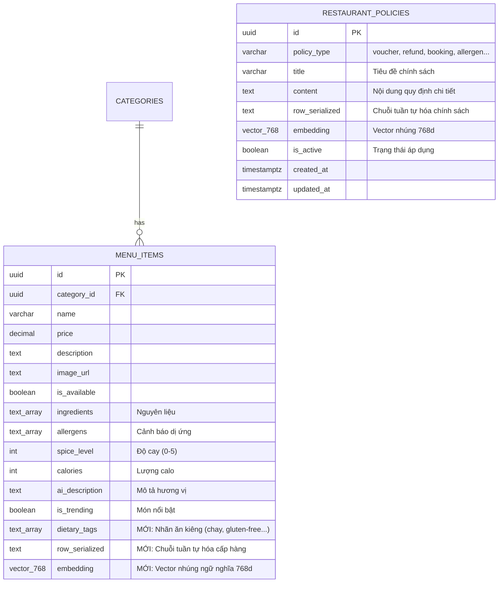
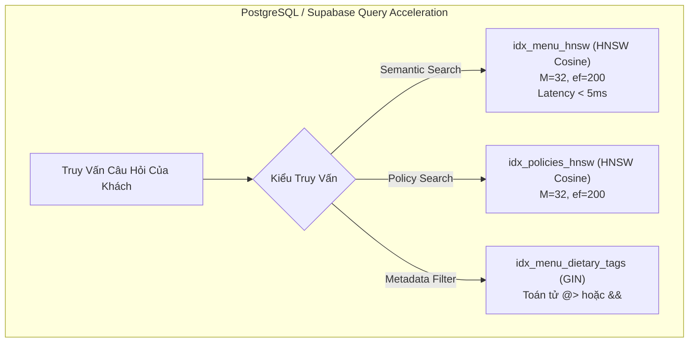

# Tài Liệu Đặc Tả Cấu Trúc CSDL Mở Rộng: Advanced RAG (Migration 28)

Tài liệu này đặc tả chi tiết cấu trúc cơ sở dữ liệu mở rộng phục vụ kiến trúc **Advanced Hybrid RAG** cho hệ thống **SmartRestaurant (AI Consultant "Aria")**, tuân thủ nghiêm ngặt phương pháp luận từ bài báo khoa học *"Advancing RAG for Structured Enterprise Data"* (IIT Roorkee, 2025).

---

## 1. Tổng Quan Kiến Trúc Dữ Liệu RAG

Để giải quyết bài toán suy luận trên dữ liệu thực đơn có cấu trúc cao (nhiều thuộc tính quan hệ như thành phần, giá, dị ứng, calo, độ cay, chế độ ăn) và chính sách nhà hàng, hệ thống sử dụng:
* **Extension:** `pgvector` trên PostgreSQL / Supabase.
* **Không gian vector (Vector Space):** 768 chiều ($\mathbb{R}^{768}$), đồng bộ với mô hình Dense Embedding `sentence-transformers/all-mpnet-base-v2`.
* **Khoảng cách tương đồng (Distance Metric):** Khoảng cách Cosine (`vector_cosine_ops`), độ đo: $\text{Similarity} = 1 - \text{Cosine Distance}$.
* **Cấu trúc lưu trữ cấp hàng (Row Serialization):** Cột `row_serialized` lưu trữ văn bản bán cấu trúc có khóa-giá trị rõ ràng, giúp embedding và BM25 bảo toàn trọn vẹn quan hệ hàng-cột.



---

## 2. Chi Tiết Các Bảng & Cột Mở Rộng

### 2.1. Bảng `menu_items` (Mở Rộng Cột RAG)

Bảng chứa toàn bộ dữ liệu món ăn trong thực đơn của nhà hàng. Migration 28 bổ sung 3 cột chuyên trách:

| Tên Cột | Kiểu Dữ Liệu | Giá Trị Mặc Định | Mô Tả Kỹ Thuật |
| :--- | :--- | :---: | :--- |
| **`embedding`** | `vector(768)` | `NULL` | Vector 768 chiều sinh ra từ mô hình `all-mpnet-base-v2`, phục vụ tìm kiếm ngữ nghĩa mờ (Dense Semantic Search). |
| **`row_serialized`** | `TEXT` | `NULL` | Chuỗi văn bản tuần tự hóa cấp hàng theo định dạng chuẩn Paper 01 Mục 3.1.2. Ví dụ:<br>`[MÓN ĂN: Phở Bò Tái Nạm]`<br>`• Phân loại: Món chính`<br>`• Giá bán: 75,000 VND`<br>`• Độ cay: 0/5`<br>`• Calo: 450 kcal`<br>`• Nguyên liệu: Bánh phở, Bắp bò, Nạm bò`<br>`• Cảnh báo dị ứng: Không có` |
| **`dietary_tags`** | `TEXT[]` | `NULL` | Mảng chứa các nhãn ăn kiêng và phân loại đặc biệt (vd: `['chay', 'thuần chay', 'không gluten', 'keto', 'healthy']`), phục vụ lọc cứng metadata qua GIN index. |

---

### 2.2. Bảng Mới: `restaurant_policies`

Bảng mới được tạo để lưu trữ các quy định, chính sách hoạt động của nhà hàng nhằm giúp Aria tư vấn chính xác về voucher, hoàn tiền, hủy bàn, dị ứng và đồ ăn mang ngoài.

| Tên Cột | Kiểu Dữ Liệu | Ràng Buộc | Mô Tả Kỹ Thuật |
| :--- | :--- | :---: | :--- |
| **`id`** | `UUID` | `PRIMARY KEY`, `DEFAULT gen_random_uuid()` | Định danh duy nhất của chính sách. |
| **`policy_type`** | `VARCHAR(50)` | `NOT NULL` | Nhóm chính sách: `'voucher'`, `'refund'`, `'table_booking'`, `'allergen'`, `'outside_food'`, `'general'`. |
| **`title`** | `VARCHAR(255)` | `NOT NULL` | Tiêu đề hiển thị của chính sách. |
| **`content`** | `TEXT` | `NOT NULL` | Nội dung văn bản chi tiết của điều khoản/quy định. |
| **`row_serialized`**| `TEXT` | `NULL` | Chuỗi tuần tự hóa dạng `[CHÍNH SÁCH: ... | Loại: ... | Nội dung: ...]`. |
| **`embedding`** | `vector(768)` | `NULL` | Vector 768 chiều phục vụ truy xuất RAG khi khách hỏi quy định. |
| **`is_active`** | `BOOLEAN` | `DEFAULT TRUE` | Trạng thái áp dụng (`true` = đang có hiệu lực). |
| **`created_at`** | `TIMESTAMPTZ` | `DEFAULT NOW()` | Thời gian tạo bản ghi. |
| **`updated_at`** | `TIMESTAMPTZ` | `DEFAULT NOW()` | Thời gian cập nhật bản ghi gần nhất. |

#### Dữ liệu mẫu khởi tạo sẵn (Seed Data):
1. **`voucher`**: Chính sách áp dụng mã giảm giá và Voucher (Tối đa 1 voucher/hóa đơn, không quy đổi tiền mặt).
2. **`refund`**: Chính sách đổi trả món và hoàn tiền (Đổi món/hủy món nếu giao sai, hư hỏng; hoàn tiền trong 24h).
3. **`table_booking`**: Quy định đặt bàn & giữ chỗ (Giữ bàn tối đa 15 phút so với giờ hẹn; khách đoàn >10 người cọc trước 2h).
4. **`allergen`**: Cam kết an toàn thực phẩm & cảnh báo dị ứng (Bếp xử lý riêng khi khách ghi chú dị ứng).
5. **`outside_food`**: Quy định mang đồ ăn, thức uống từ ngoài vào (Tính phí phục vụ/phí khui chai).

---

## 3. Chiến Lược Chỉ Mục Hiệu Năng Cao (Indexing Strategy)



### 3.1. Chỉ Mục HNSW (Hierarchical Navigable Small World)
Khác với thuật toán IVFFlat (yêu cầu phân cụm trước và độ chính xác thấp hơn), **HNSW** xây dựng đồ thị nhiều tầng trên không gian vector:
* **Tham số cấu hình theo Paper 01:**
  * $M = 32$: Số lượng liên kết tối đa trên mỗi nút trong đồ thị vector.
  * $ef\_construction = 200$: Kích thước danh sách ứng viên động trong quá trình xây dựng chỉ mục (đảm bảo độ phủ Recall $\ge 90\%$).
* **Lệnh SQL:**
  ```sql
  CREATE INDEX IF NOT EXISTS idx_menu_hnsw 
  ON menu_items USING hnsw (embedding vector_cosine_ops) 
  WITH (m = 32, ef_construction = 200);

  CREATE INDEX IF NOT EXISTS idx_policies_hnsw 
  ON restaurant_policies USING hnsw (embedding vector_cosine_ops) 
  WITH (m = 32, ef_construction = 200);
  ```

### 3.2. Chỉ Mục GIN (Generalized Inverted Index)
Tối ưu hóa các truy vấn lọc cứng thuộc tính mảng (Array Containment):
```sql
CREATE INDEX IF NOT EXISTS idx_menu_dietary_tags 
ON menu_items USING gin (dietary_tags);
```

---

## 4. Các Hàm RPC Stored Procedures

Hai hàm RPC được viết bằng `PL/pgSQL` để cho phép Backend Node.js / AI Service gọi trực tiếp qua Supabase SDK với độ trễ thấp nhất.

### 4.1. Hàm `match_menu_items`
Tìm kiếm top món ăn tương đồng với vector câu hỏi:
```sql
CREATE OR REPLACE FUNCTION match_menu_items (
  query_embedding vector(768),
  match_threshold float DEFAULT 0.0,
  match_count int DEFAULT 20
)
RETURNS TABLE (
  id uuid,
  name varchar,
  price decimal,
  description text,
  image_url text,
  category_id uuid,
  ingredients text[],
  allergens text[],
  spice_level int,
  calories int,
  dietary_tags text[],
  row_serialized text,
  similarity float
)
```

### 4.2. Hàm `match_restaurant_policies`
Tìm kiếm chính sách nhà hàng liên quan:
```sql
CREATE OR REPLACE FUNCTION match_restaurant_policies (
  query_embedding vector(768),
  match_threshold float DEFAULT 0.0,
  match_count int DEFAULT 5
)
RETURNS TABLE (
  id uuid,
  policy_type varchar,
  title varchar,
  content text,
  row_serialized text,
  similarity float
)
```

---

## 5. Hướng Dẫn Vận Hành & Quản Lý Migration

### 5.1. File Up Migration (Nâng cấp Schema)
* **Đường dẫn:** `database/migrations/28_add_rag_vector_columns.sql`
* **Cách thực thi:**
  1. Mở Supabase SQL Editor.
  2. Dán nội dung file và bấm **Run**.

### 5.2. File Down Migration (Rollback An Toàn)
* **Đường dẫn:** `database/migrations/28_add_rag_vector_columns_rollback.sql`
* **Cách thực thi:** Chỉ chạy khi cần hoàn tác toàn bộ schema về trạng thái trước migration 28.

### 5.3. Kiểm Tra Nghiệm Thu Sau Khi Chạy
```sql
-- 1. Xác nhận các cột RAG đã tồn tại
SELECT column_name, data_type, udt_name 
FROM information_schema.columns 
WHERE table_name = 'menu_items' 
  AND column_name IN ('embedding', 'row_serialized', 'dietary_tags');

-- 2. Xác nhận chỉ mục HNSW đang hoạt động
SELECT indexname, indexdef 
FROM pg_indexes 
WHERE tablename IN ('menu_items', 'restaurant_policies');

-- 3. Kiểm tra số lượng chính sách đã seed
SELECT count(*) AS total_policies FROM restaurant_policies;
```
