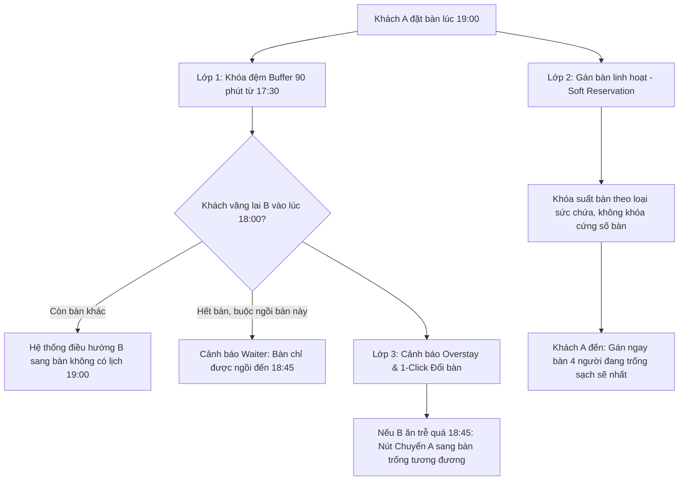
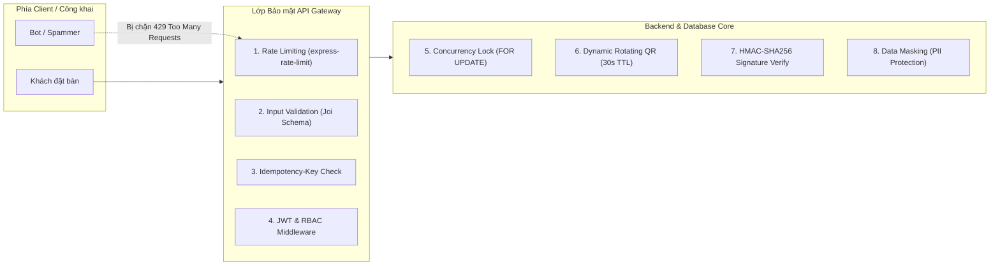

# 🚀 KẾ HOẠCH GIAI ĐOẠN 5 (PHASE 5): NÂNG CẤP VẬN HÀNH & ĐỊNH HƯỚNG AI

> **Đội ngũ phát triển:** 02 Developers (Có sự hỗ trợ của công cụ AI lập trình)  
> **Trọng tâm tài liệu:** Đánh giá kỹ hiện trạng hệ thống, lập phương án kiến trúc tối ưu nhất và bảng Checklist công việc cụ thể cho **Giai đoạn 1** (đã giải quyết triệt để bài toán xung đột bàn lấn giờ); định hướng mở các phương án ứng dụng AI cho **Giai đoạn 2**; và hệ thống các **Lưu ý Kỹ thuật & Bảo mật API** toàn diện.

---

## 🔍 1. ĐÁNH GIÁ HIỆN TRẠNG HỆ THỐNG & PHƯƠNG ÁN KIẾN TRÚC

### 1.1. Hiện trạng nền tảng sẵn có (Tận dụng 100%, không đập đi xây lại)
1. **Cơ sở dữ liệu (PostgreSQL / Supabase):**
   - Đã có `table_status` ENUM với giá trị `'reserved'` (cùng với `'available'`, `'occupied'`) từ `01_init_schema.sql`.
   - Bảng `tables` đã có các trường `capacity`, `location`, `description`, `is_active`, `qr_code_token`.
   - Bảng `users` đã có phân quyền chuẩn `user_role` (`admin`, `waiter`, `kitchen`, `customer`).
2. **Backend (Node.js / Express):**
   - Đã có `authMiddleware` (xác thực JWT) và `roleMiddleware` (chặn theo role).
   - Đã có `staffController` quản lý đầy đủ tài khoản nhân viên (Waiter, Kitchen).
   - Đã có `emailService` (Nodemailer) gửi email kích hoạt, mời nhân viên và gửi file QR.
   - Đã có `socket.io` với cơ chế phân phòng (`room` waiter, kitchen, admin) để gửi thông báo tức thì.
   - Đã có thư viện kiểm thực `Joi` chuẩn hóa dữ liệu.
3. **Frontend (React / Vite / Tailwind):**
   - Đã có trang quản lý bàn: `TableManagement.jsx` (Admin) và `TableMapPage.jsx` (Waiter xem sơ đồ bàn trực quan).
   - Đã có trang quản lý nhân viên: `StaffManagement.jsx` (Admin).
   - Đã có `SocketContext` kết nối socket toàn ứng dụng.

---

### 1.2. Nhận định Điểm nghẽn & Giải pháp 3 Lớp Chống Xung Đột Bàn (Conflict & Overstay)

#### ⚠️ Bài toán thực tế:
Nếu khách A đặt bàn lúc **19:00**, nhưng khách vãng lai B vào lúc **18:00** (trước 1 tiếng) và ngồi ăn đến **19:30** mới xong -> Khi khách A đến lúc 19:00 sẽ **không có bàn ngồi**!

#### 🛡️ Giải pháp 3 lớp xử lý triệt để:



1. **Lớp 1 - Quy tắc Thời gian dùng bữa đệm (Buffer Turn-time 90 phút):**
   - Thời gian ăn trung bình một bữa là 90 phút. Nếu Bàn số 5 có lịch đặt lúc **19:00**, thì từ **17:30** (trước 90 phút), hệ thống gắn cờ trên sơ đồ bàn: `Sắp có khách đặt (19:00)`.
   - Nếu khách vãng lai B vào lúc 18:00: Hệ thống ưu tiên hướng nhân viên xếp B sang bàn khác. Nếu hết bàn buộc phải ngồi bàn này, hệ thống hiện Popup cảnh báo: *"Bàn có lịch lúc 19:00 (chỉ còn 60p). Xác nhận khách đồng ý trả bàn trước 18:45?"*.
2. **Lớp 2 - Gán bàn linh hoạt (Soft Reservation vs Hard Reservation):**
   - Khi khách A đặt online, hệ thống chỉ giữ **1 suất bàn 4 người** (đảm bảo đủ công suất tổng thể lúc 19:00), **chưa khóa cứng vào một số bàn vật lý duy nhất**.
   - Đến 18:50 (10 phút trước giờ hẹn) hoặc khi khách A đến check-in: Nhân viên chỉ cần bấm 1 chạm để gán khách A vào **bàn 4 người nào đang trống và sạch sẽ nhất** lúc đó.
3. **Lớp 3 - Cảnh báo khách ngồi quá giờ (Overstay Alert) & Đổi bàn 1-Click:**
   - Nếu một bàn đã gán cho khách A nhưng khách B ngồi ăn quá giờ hẹn: Trước giờ hẹn 15 phút, viền bàn trên sơ đồ sẽ chớp màu đỏ cảnh báo *"Nguy cơ trễ giờ đón khách A"*.
   - Nhân viên chỉ cần nhấn nút **`[Đổi bàn cho khách A]`**: Hệ thống tự động quét và chuyển sang bàn trống tương đương khác ngay lập tức, không làm phiền khách B và khách A vẫn có bàn đón tiếp chu đáo.

---

## 📋 2. CHECKLIST CÔNG VIỆC GIAI ĐOẠN 1 (KÈM ƯỚC LƯỢNG THỜI GIAN)

> **Điều kiện ước lượng:** Đội ngũ gồm **02 Developers** và có sự hỗ trợ của **công cụ AI lập trình** (GitHub Copilot, Cursor, LLM scaffold generation) giúp sinh nhanh cấu trúc code, migration SQL, form UI và kiểm thử tự động.

---

### PHẦN A: HỆ THỐNG ĐẶT BÀN TRƯỚC (TABLE RESERVATION)

#### 1. Cơ sở dữ liệu (Database)
- [ ] **Migration bảng `reservations` (`30_add_reservations_and_shifts.sql`)** `[Ước lượng: 2.5 giờ]`
  - Tạo bảng `reservations` gồm: `id`, `user_id`, `customer_name`, `customer_phone`, `customer_email`, `table_id` (cho phép NULL ban đầu nếu chọn Soft Allocation), `guest_count`, `reservation_date`, `reservation_time`, `end_time`, `status` (`pending`, `confirmed`, `seated`, `cancelled`, `no_show`), `deposit_amount`, `deposit_status`, `special_requests`, `buffer_minutes` (mặc định 90), `booking_code` (mã đặt bàn ngẫu nhiên bí mật chống IDOR).
  - Đánh Index trên cặp cột `(reservation_date, reservation_time)` và `status`.

#### 2. Backend API & Nghiệp vụ (Node.js / Express)
- [ ] **API Tra cứu bàn & khung giờ trống (`GET /api/reservations/available-slots`)** `[Ước lượng: 4.5 giờ]`
  - Nhận vào: Ngày và số lượng khách.
  - Xử lý: Lọc tổng số bàn theo sức chứa (`capacity >= guest_count`). Áp dụng cửa sổ đệm `[thời_gian ± 90 phút]` để tính toán số lượng bàn còn nhận được, đảm bảo không bị Overbooking.
- [ ] **API Đặt bàn mới (`POST /api/reservations`)** `[Ước lượng: 3.5 giờ]`
  - Validate dữ liệu đầu vào bằng `Joi`.
  - Hỗ trợ cơ chế **Soft Reservation**: Lưu yêu cầu đặt bàn và tạm giữ slot sức chứa, tự động gán gợi ý bàn ban đầu.
- [ ] **Tích hợp Email & Thông báo Real-time** `[Ước lượng: 3 giờ]`
  - Gửi email xác nhận đặt bàn thành công kèm mã QR định danh lượt đặt qua `emailService`.
  - Bắn Socket.io event `new_reservation` tới room `waiter` và `admin` để chuông thông báo reo ngay khi có khách đặt.
- [ ] **API Quản lý trạng thái & Xử lý xung đột bàn (Admin/Waiter)** `[Ước lượng: 4.5 giờ]`
  - `GET /api/reservations`: Lấy danh sách đặt bàn theo ngày và trạng thái.
  - `PATCH /api/reservations/:id/check-in`: Khách đến -> Gán bàn thực tế và chuyển bàn sang `occupied`.
  - `POST /api/reservations/:id/reallocate`: **1-Click Đổi bàn dự phòng** khi bàn cũ bị khách trước ngồi quá giờ (Overstay).
- [ ] **Tích hợp Đặt cọc giữ chỗ (Áp dụng nhóm đông ≥ 6 người)** `[Ước lượng: 4 giờ]`
  - Tích hợp cổng thanh toán (Stripe / ZaloPay) tạo phiên cọc nếu đơn đặt bàn thuộc diện bắt buộc cọc.

#### 3. Frontend Giao diện người dùng (React / Tailwind)
- [ ] **Giao diện Đặt bàn cho Khách hàng (Reservation Page / Modal)** `[Ước lượng: 6 giờ]`
  - Form chọn ngày, giờ đến, số lượng người, khu vực ưu tiên (ngoài trời, phòng lạnh) và ghi chú đặc biệt.
  - Màn hình xác nhận thành công hiển thị mã QR đặt chỗ.
- [ ] **Giao diện Quản lý Đặt bàn & Sơ đồ bàn thông minh cho Waiter/Admin** `[Ước lượng: 7.5 giờ]`
  - Cập nhật `TableMapPage.jsx`: Hiển thị nhãn màu vàng `Sắp có khách đặt (19:00)` trước 90 phút.
  - Popup cảnh báo khi xếp khách vãng lai vào bàn sắp có lịch hẹn.
  - Viền đỏ chớp nháy cảnh báo Overstay và nút bấm nhanh **`[Đổi bàn cho khách A]`**.
  - Tab "Lịch Đặt Bàn" hiển thị timeline các lượt đặt trong ngày.

---

### PHẦN B: HỆ THỐNG XẾP LỊCH & QUẢN LÝ CA LÀM VIỆC (STAFF SCHEDULING)

#### 1. Cơ sở dữ liệu (Database)
- [ ] **Migration bảng `shifts`, `shift_assignments` & `shift_swap_requests` (`30_add_reservations_and_shifts.sql`)** `[Ước lượng: 2 giờ]`
  - Bảng `shifts`: `id`, `name` (Ca sáng, Ca chiều, Ca gãy), `start_time`, `end_time`, `min_staff` (JSON lưu định mức waiter, kitchen).
  - Bảng `shift_assignments`: `id`, `shift_id`, `user_id`, `shift_date`, `status` (`scheduled`, `checked_in`, `checked_out`, `absent`, `swapped`), `check_in_time`, `check_out_time`. Unique constraint `(user_id, shift_date, shift_id)`.
  - Bảng `shift_swap_requests`: lưu thông tin đổi ca và trạng thái phê duyệt của quản lý.

#### 2. Backend API & Nghiệp vụ (Node.js / Express)
- [ ] **API CRUD Cấu hình ca làm việc (`/api/admin/shifts`)** `[Ước lượng: 3 giờ]`
  - Quản lý tạo, sửa, xóa các khung ca và định mức nhân sự tối thiểu mỗi ca.
- [ ] **API Xếp lịch tuần (`GET /api/admin/rosters`, `POST /api/admin/rosters/assign`)** `[Ước lượng: 4 giờ]`
  - Lấy danh sách phân ca theo tuần; Gán nhân viên vào ca trực kèm kiểm tra trùng ca hoặc quá giờ công.
- [ ] **API Đổi ca trực giữa nhân viên (Shift Swap)** `[Ước lượng: 3 giờ]`
  - Nhân viên gửi yêu cầu đổi ca -> Đồng nghiệp xác nhận -> Quản lý duyệt.
- [ ] **API Điểm danh ca trực (Check-in / Check-out)** `[Ước lượng: 3 giờ]`
  - Nhân viên quét mã QR tại quầy để điểm danh bắt đầu và kết thúc ca làm việc.

#### 3. Frontend Giao diện người dùng (React / Tailwind)
- [ ] **Giao diện Bảng phân ca tuần cho Admin (Weekly Roster Grid)** `[Ước lượng: 8 giờ]`
  - Bảng lưới ma trận 7 ngày x các ca làm việc. Cho phép chọn nhân viên vào từng ca, cảnh báo màu đỏ nếu ca bị thiếu người so với định mức.
- [ ] **Giao diện Cổng nhân viên (Staff Portal / My Shifts trên Mobile)** `[Ước lượng: 5 giờ]`
  - Màn hình xem lịch trực cá nhân trong tuần, nút bấm điểm danh ca làm, form đăng ký đổi ca hoặc báo bận.

---

### 🏁 TỔNG KẾT THỜI GIAN GIAI ĐOẠN 1
* **Phần A (Hệ thống Đặt bàn & Chống xung đột Overstay):** **25 giờ** (~3.1 ngày làm việc)
* **Phần B (Xếp lịch nhân sự & Điểm danh ca trực):** **22 giờ** (~2.75 ngày làm việc)
* **Kiểm thử liên thông & Hoàn thiện toàn diện:** **5 giờ** (~0.6 ngày làm việc)
* 👉 **TỔNG CỘNG:** **52 giờ làm việc** (Tương đương **6.5 ngày làm việc** cho đội ngũ 2 Developers có sự hỗ trợ của AI).

---

## 🔮 3. GIAI ĐOẠN 2: ĐỊNH HƯỚNG CÁC PHƯƠNG ÁN ỨNG DỤNG AI (ĐỂ LỰA CHỌN KỸ THUẬT SAU)

*Giai đoạn này không ấn định kỹ thuật cứng nhắc, mà vạch ra các hướng đi tiềm năng dựa trên nền tảng nghiệp vụ vừa hoàn thiện ở Giai đoạn 1 để lựa chọn công nghệ phù hợp:*

1. **Hướng 1: Tối ưu hóa phân bổ bàn ăn (Smart Table Allocation):**
   - *Mục tiêu:* Tự động xếp bàn tối ưu khi khách đặt, tự động phát hiện và điều chuyển bàn thông minh khi có nguy cơ overstay mà không cần nhân viên thao tác thủ công.
   - *Hướng kỹ thuật có thể chọn:* Sử dụng LLM API (Gemini Flash) với JSON Schema hoặc Thuật toán tối ưu hóa ràng buộc (Constraint Programming / Heuristic).

2. **Hướng 2: Tự động hóa xếp lịch làm việc (Auto-Roster Engine):**
   - *Mục tiêu:* Một nút bấm tự động xếp ca làm việc cho 20 - 40 nhân viên trong tuần, đảm bảo đủ người vào giờ cao điểm, chia đều ca khó và tuân thủ luật lao động.
   - *Hướng kỹ thuật có thể chọn:* Gọi Gemini Pro / Flash API áp dụng kỹ thuật Chain-of-Thought (CoT) Prompting kết hợp cơ chế chạy nền bất đồng bộ (Async Queue).

3. **Hướng 3: Trợ lý tiếp nhận đặt bàn bằng ngôn ngữ tự nhiên (Conversational Booking Concierge):**
   - *Mục tiêu:* Khách hàng có thể nhắn tin hoặc ra lệnh giọng nói bằng một câu tự nhiên (ví dụ: *"Đặt bàn 4 người tối thứ 7 lúc 19h chỗ thoáng mát"*), hệ thống tự động trích xuất thông tin và tạo lịch đặt bàn.
   - *Hướng kỹ thuật có thể chọn:* Nâng cấp trợ lý AI "Aria" có sẵn với kỹ thuật **Function Calling / Tool Calling** và phản hồi qua luồng **SSE Streaming**.

4. **Hướng 4: Dự báo nhu cầu đặt bàn & khách hàng (Demand Forecasting):**
   - *Mục tiêu:* Dự đoán số lượng khách và các khung giờ cao điểm theo ngày lễ/thời tiết dựa trên lịch sử đặt bàn, giúp quản lý chủ động bố trí nhân lực từ sớm.
   - *Hướng kỹ thuật có thể chọn:* Machine Learning phân tích chuỗi thời gian hoặc gọi LLM tổng hợp đa yếu tố.

---

## 🔒 4. LƯU Ý KỸ THUẬT & BẢO MẬT API (SECURITY & ARCHITECTURE BEST PRACTICES)

Để đảm bảo hệ thống vận hành ổn định, không bị tấn công trục lợi hoặc lộ dữ liệu người dùng, đội ngũ cần tuân thủ nghiêm ngặt 8 nguyên tắc kỹ thuật và bảo mật sau khi xây dựng các API mới:



---

### 4.1. Chống lỗi IDOR & Bảo vệ API Công khai (Insecure Direct Object Reference)
* **Vấn đề rủi ro:** API tra cứu hoặc hủy đặt bàn nếu chỉ dùng URL dạng `GET /api/reservations/:id` (với ID là số hoặc UUID tăng dần) sẽ bị kẻ xấu quét (brute-force) để xem trộm toàn bộ thông tin khách hàng, số điện thoại hoặc hủy bàn của người khác.
* **Giải pháp bắt buộc:**
  - Khách vãng lai tra cứu thông tin đặt bàn phải thông qua **Mã đặt bàn ngẫu nhiên bí mật (`booking_code`)** dạng NanoID 8 ký tự (VD: `SR-8K9M2P`) kết hợp với **4 số cuối điện thoại xác thực**.
  - Đối với đường link "Hủy đặt bàn" gửi qua Email: Phải sinh **Signed JWT Token** có thời hạn (TTL 24h), chứa payload `{ reservation_id, action: 'cancel' }`, ký bằng `JWT_SECRET`. Khi người dùng click link, server verify token hợp lệ mới cho phép hủy.

---

### 4.2. Chống Spam, Bot Đặt ảo & Tấn công DoS (Rate Limiting & Anti-Abuse)
* **Vấn đề rủi ro:** Kẻ xấu hoặc đối thủ dùng tool gọi API `POST /api/reservations` hàng ngàn lần để chiếm toàn bộ bàn trong giờ cao điểm ("giữ chỗ ma"), làm tê liệt việc kinh doanh của nhà hàng.
* **Giải pháp bắt buộc:**
  - Cài đặt `express-rate-limit`: Giới hạn tối đa **5 request đặt bàn / 15 phút trên mỗi địa chỉ IP**.
  - Áp dụng kiểm tra độ trễ hành vi (Behavior Delay): Tối thiểu 10 giây giữa 2 lượt tạo booking trên cùng 1 session trình duyệt.
  - Giới hạn gửi Email xác nhận qua `emailService`: Tối đa **3 email / 10 phút** cho cùng một địa chỉ email để chống hao tốn quota và tránh bị liệt vào danh sách Spam (Blacklist).

---

### 4.3. Kiểm soát Xung đột Đồng thời & Chống Đặt trùng (Concurrency & Race Conditions)
* **Vấn đề rủi ro:** Khi chỉ còn đúng 1 bàn trống cuối cùng lúc 19:00, 2 khách hàng ở 2 nơi khác nhau cùng bấm nút "Xác nhận đặt bàn" tại cùng 1 mili-giây. Cả 2 request đều query thấy còn bàn trống và cùng insert -> **Gây Overbooking**.
* **Giải pháp bắt buộc:**
  - Sử dụng Database Transaction với mức cô lập nghiêm ngặt hoặc khóa bi quan (**Pessimistic Locking**):
    ```sql
    -- Khóa hàng kiểm tra slot trước khi insert
    SELECT * FROM reservations 
    WHERE reservation_date = $1 
      AND reservation_time BETWEEN $2 AND $3
      AND status NOT IN ('cancelled', 'no_show')
    FOR UPDATE;
    ```
  - Áp dụng Header `Idempotency-Key` (UUIDv4 do Client sinh ra khi mở form): Nếu khách hàng bị giật lag và click đúp nút "Đặt bàn", Backend phát hiện trùng `Idempotency-Key` sẽ trả về kết quả cũ mà không trừ thêm slot hay tạo bản ghi trùng lặp.

---

### 4.4. Bảo mật Điểm danh & Chống Gian lận QR (Anti-Spoofing Attendance QR)
* **Vấn đề rủi ro:** Nhân viên chụp ảnh mã QR điểm danh dán ở quầy thu ngân gửi cho đồng nghiệp ở nhà để "điểm danh hộ".
* **Giải pháp bắt buộc:**
  - Tuyệt đối **không** dùng mã QR tĩnh.
  - Sử dụng **Mã QR động (Dynamic Rotating Token)** hiển thị trên màn hình POS của quầy thu ngân:
    - Token trong QR là JWT chứa timestamp hiện tại và có thời hạn sống (**TTL**) chỉ **30 giây**.
    - Cứ sau 30 giây, màn hình POS tự động gọi WebSocket cập nhật mã QR mới. Ảnh chụp màn hình gửi qua Zalo sau 30 giây sẽ lập tức hết hạn (`TokenExpiredError`).
  - Kiểm tra Subnet IP: Backend so khớp IP của nhân viên (`req.ip`) phải thuộc dải mạng Wifi nội bộ của quán mới chấp nhận Check-in ca trực.

---

### 4.5. Bảo mật Cổng Thanh toán & Webhook (Payment Webhook Security)
* **Vấn đề rủi ro:** Hacker giả mạo gửi request `POST /api/payment/webhook` với nội dung `deposit_status: "paid"` để đặt cọc miễn phí.
* **Giải pháp bắt buộc:**
  - Bắt buộc kiểm tra chữ ký Webhook (**Signature Verification**):
    - Đối với Stripe: `stripe.webhooks.constructEvent(req.body, sig, endpointSecret)`.
    - Đối với ZaloPay/MoMo: Tính mã HMAC-SHA256 từ payload và đối chiếu với chữ ký gửi trên Header.
  - Phải dùng `express.raw({ type: 'application/json' })` cho route Webhook để giữ nguyên vẹn raw bytes phục vụ kiểm tra chữ ký.
  - Xử lý Idempotent: Nếu đơn đặt cọc đã ở trạng thái `paid`, server trả về `200 OK` ngay lập tức, không xử lý lại logic cộng tiền/gán bàn.

---

### 4.6. Bảo vệ Quyền riêng tư Dữ liệu Khách hàng (PII Protection)
* **Tuân thủ Nghị định 13/2023/NĐ-CP về Bảo vệ dữ liệu cá nhân:**
  - Che mờ dữ liệu (Data Masking): Khi hiển thị danh sách đặt bàn trên màn hình phục vụ chung (`TableMapPage`), số điện thoại và email khách hàng phải được che bớt: `0987***321` hoặc `n***@gmail.com`.
  - Chỉ tài khoản có Role `admin` mới được xem đầy đủ thông tin liên hệ của khách hàng.
  - **Sanitization Log:** Tuyệt đối không log thông tin thẻ, JWT Token, số điện thoại hay email thô của khách vào hệ thống Console hay file Log server.

---

### 4.7. Bảo mật Kết nối Real-time (Socket.IO Room Authorization)
* **Vấn đề rủi ro:** Khách hàng bình thường mò được kết nối Socket và gửi event `socket.emit('join_room', 'waiter')` hoặc `'admin'` để nghe lén toàn bộ thông báo khách đặt bàn, thông tin cá nhân và doanh thu của quán.
* **Giải pháp bắt buộc:**
  - Xác thực nghiêm ngặt trong sự kiện `join_room` tại `backend/src/config/socket.js`:
    ```javascript
    socket.on('join_room', (room) => {
      const user = socket.user; // Đã decode từ JWT handshake
      if (room === 'waiter' && (!user || !['waiter', 'admin', 'super_admin'].includes(user.role))) {
        return socket.emit('error', { message: 'Unauthorized room access' });
      }
      socket.join(room);
    });
    ```

---

### 4.8. Chuẩn hóa Validation & Xử lý Ngoại lệ (Joi & Error Handling)
* Tất cả dữ liệu đầu vào của các API mới phải đi qua Joi Middleware:
  - Regex số điện thoại Việt Nam: `/^(0|\+84)[3|5|7|8|9][0-9]{8}$/`.
  - Validate định dạng ngày giờ chuẩn ISO: `YYYY-MM-DD` và `HH:mm`.
  - Escape và Sanitize các chuỗi nhập tự do (`special_requests`, `notes`) để ngăn ngừa tấn công XSS và SQL Injection.
* Không bao giờ trả về Database Stack Trace (lỗi PostgreSQL thô) cho client khi xảy ra lỗi 500. Trả về mã lỗi chuẩn hóa kèm thông báo thân thiện:
  ```json
  {
    "success": false,
    "error": {
      "code": "RESERVATION_CONFLICT",
      "message": "Bàn đã có lượt đặt trong khung giờ này. Vui lòng chọn khung giờ khác."
    }
  }
  ```
